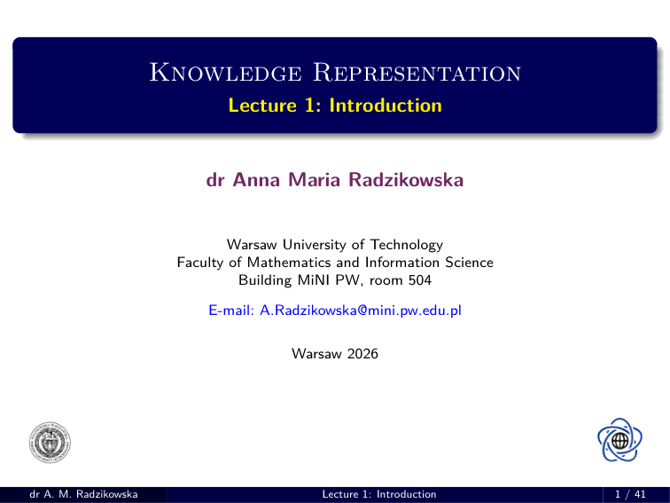
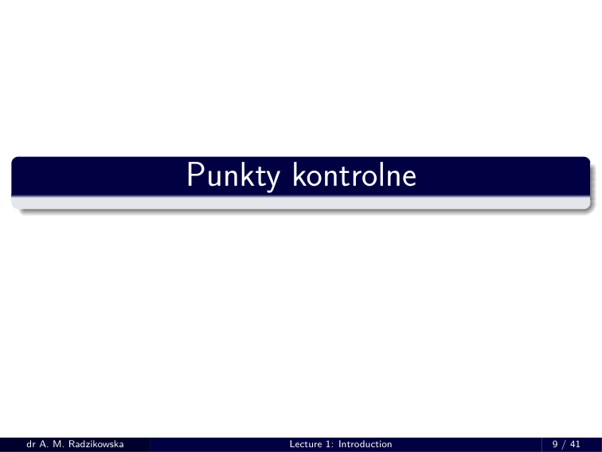
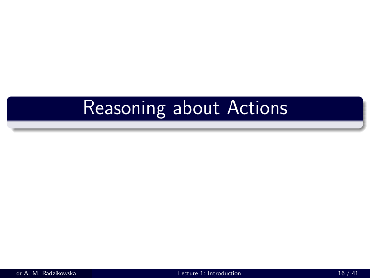
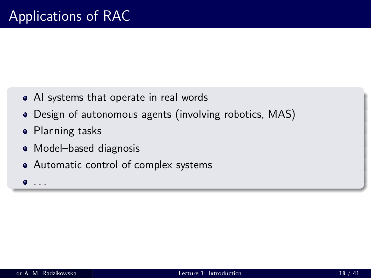
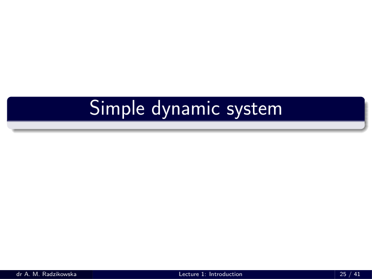
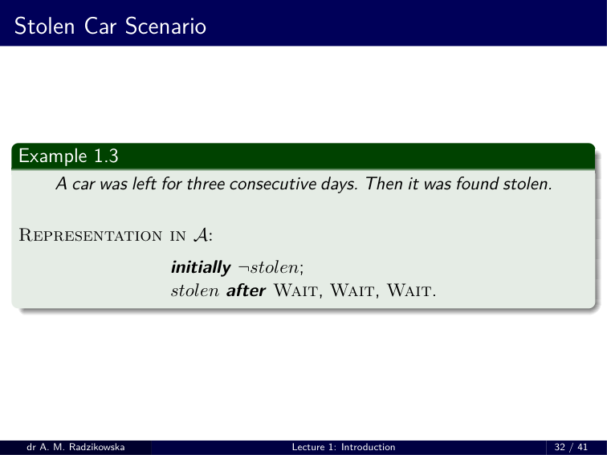
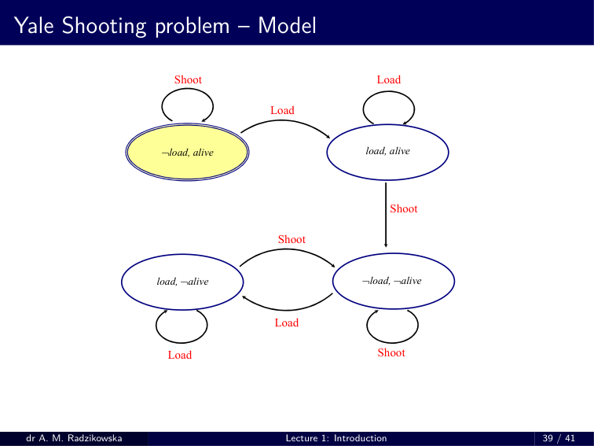
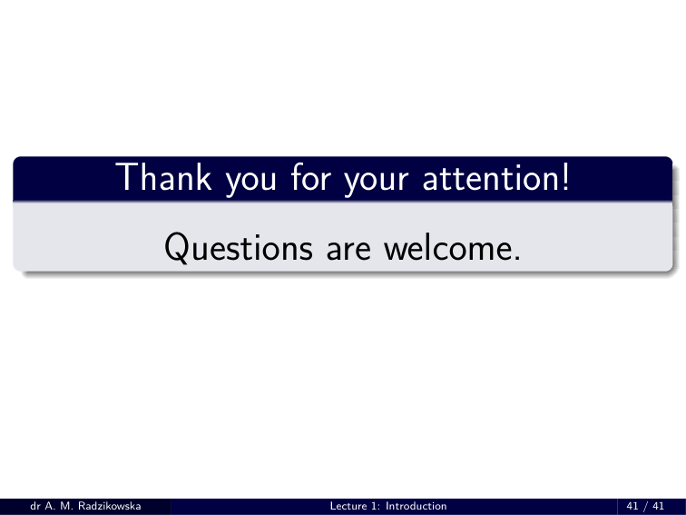

# RW 01 – HANDOUT

> Source: `RW_01___HANDOUT.pdf`

---

## Knowledge Representation

---

## Overview

1. Course regulations
2. Project checkpoints
3. Reasoning about Actions
4. Ontologies of actions
5. Main problems in RAC
  - Frame problem
  - Ramification problem
  - Qualification problem
6. Simple dynamic system
  - Action language *A*
  - Statements in *A*
  - Examples
  - Semantics of *A*

---

## Regulamin przedmiotu

1. Przedmiot obejmuje: 45 godz. wykładu i 30 godz. zajęć projektowych.
2. Przedmiot kończy się egzaminem. Student ma prawo przystąpić do wszystkich trzech terminów egzaminu (2 terminy w czerwcu, 1 termin we wrześniu).
3. Uczestnictwo:
    - w wykładach nie jest obowiązkowa;
    - w zajeciach projektowych jest obowiazkowa w wyznaczonych punktach kontrolnych, w pozostałych terminach zajęcia odbywają się na życzenie studentów (dyskusje nad zadaniem, przedstawienie propozycji rozwiązań, wyjaśnienia niejasności itp.)
4. Łączna ocena z przedmiotu obejmuje:
    - max. **20 punktów** z projektu (w sesji wrześniowej max. **15 punktów** );
    - max. **30 punktów** z egzaminu.
5. Uzyskanie pozytywnej oceny z przedmiotu wymaga spełnienia nastepujących dwóch warunków: **min. 11 punktów** z części projektowej oraz **min. 16 punktów** z egzaminu.

---

## Regulamin przedmiotu (cd.)

6. Część projektowa:
    - W trakcie semestru studenci piszą duży projekt zespołowy w grupach 7-8 osobowych. Zespół projektowy zostaje ustalony na początku semestru.
    - Temat zadania jest losowany sposród kilku zaproponowanych przez prowadzącego. Nie może być on zmieniony w trakcie semestru.
    - Projekt obejmuje: część teoretyczną, część implementacyjną i część testową.
    - Każdy student uczestniczy we **wszystkich** trzech częściach projektu.
    - Zespół projektowy wybiera **koordynatora** :
    - Odpowiada za sprawny przebieg prac.
    - Prezentuje poszczególne etapy projektu.
    - Jest aktywnie zaangażowany w każdym etapie prac projektowych.
    - Określa stopień zaangażowania członków zespołu, może przyznać do 2p bonusowych co najwyżej 2 osobom szczególnie zaangażowanym w przygotowanie projektu.

---

## Regulamin przedmiotu (cd.)

7. Część projektowa (cd.):
    - Końcowe oddanie projektu obejmuje
  - Prezentację działania aplikacji.
  - Złożenie aplikacji (pliku wykonywalnego).
  - Złożenie (w formie papierowej i elektronicznej) następujących
    - dokumentów:
    - opracowania teoretycznego,
    - dokumentacji technicznej,
    - instrukcji obslugi aplikacji,
    - opracowania przeprowadzonych testów,
    - dokładnego opisu udziału poszczególnych członków zespołu w przygotowaniu projektu z ich procentowym udziałem w tych pracach.

---

## Regulamin przedmiotu (cd.)

8. Część projektowa (cd.):
    - Za projekt każdy otrzymuje max. 20p, jeśli projekt jest oddany terminowo (do 12.06.2025), jeśli projekt jest oddany w terminie wrześniowym, każdy z członków zespołu może uzyskać max. 15p.
    - Ocena indywidualna za projekt:
    - Każdy otrzymuje po max. **8p** za część teoretyczną i aplikację oraz max. **4p** za część testową.
    - Finalna ocena zależy od indywidualnego wkładu w te części, w których student uczestniczył, oraz od jakości tej części.
    - Ocena za część teoretyczną/aplikację:
  - Niech w tej części uczestniczy *N* osób. Wówczas max. punkacja:
    - *P* = *N ·* 8 punktów. (np. dla *N* = 8 , *P* = 64 p). — Ocena za tę część *S* % . Wówczas punktacja: *p* =
    - *S* 100 *· P* punktów
    - (np. dla *S* = 75% , *p* = 48 p).
  - Student(ka) ma wkład *k* % . Otrzymuje wtedy *pkt* =
    - *k* 100 *· p* punktów,
    - lecz nie więcej niż 8p. (np. *k* = 1
  6. = 16 *,* 7% , *pkt* = 8 p).
    - Ocena za część testową jest analogiczna, przy czym tu *P* = *N ·* 2 p, gdzie *N* to liczność zespołu.

---

## Regulamin przedmiotu (cd.)

9. Egzamin:
    - Egzamin obejmuje jedynie część pisemną i jest obowiazkowy dla wszystkich studentów.
    - Składa się z części testowej (ocenianej na max. 20p) i zadaniowej (ocenianej na max. 10p.)
    - Część testowa jest testem wielokrotnego wyboru. Obejmuje 10 pytań testowych, z których każde ma 4 opcje wyboru, przy czym dokładnie jedna, dwie, trzy lub cztery z nich mogą być prawidłowe. Poprawną odpowiedzią na pytanie jest zaznaczenie **wszystkich** opcji prawidłowych i **brak zaznaczenia** jakiejkolwiek nieprawidłowej. Podanie poprawnej odpowiedzi jest oceniane na **2p** , odpowiedź błędna jest oceniana na **0p** .
    - Część zadaniowa obejmuje 1 zadanie, należy podać **dokładne** rozwiązanie i je **precyzyjnie** uzasadnić.

---

## Regulamin przedmiotu (cd.)

10. Ocena ogólna z przedmiotu wyznaczana jest na podstawie uzyskanych punktów:
    - **Przedział punktowy**
    - **Ocena**
    - [27, 31]
    - dost
    - (31–36]
    - dost 1
  2. (36–41] db (41–46] db 1
  2. powyżej 46 bdb
11. Materiały z wykładów oraz aktualne informacje są dostępne na MS Teams w zespole “RW 2026’. oraz pod adresem
  - https: *//* pages.mini.pw.edu.pl/ *∼* radzikowskaa/Courses/RW 2026/Lectures

---

## Punkty kontrolne

---

## Punkt kontrolny 1: Postęp w części teoretycznej

- Wstępna prezentacja części teoretycznej projektu.

### 26.03.2026 (czwartek)

  - Projekt 1: 15:30 – 15:45
  - Projekt 2: 15:45 – 16:00
  - Projekt 3: 16:15 – 16:30

### 27.03.2026 (piątek)

  - Projekt 4: 15:15 – 15:30
  - Projekt 5: 15:30 – 15:45

---

## Punkt kontrolny 2: Oddanie części teoretycznej

- Pełna prezentacja części teoretycznej projektu, w tym:
  - wydrukowany opis (w LaTeXu!) części teoretycznej projektu,
  - odpowiadający mu plik PDF na CD.

### 23.04.2026 (czwartek)

  - Projekt 1: 14:15 – 15:00
  - Projekt 2: 15:00 – 15:45
  - Projekt 3: 16:00 – 16:45

### 24.04.2026 (piątek)

  - Projekt 4: 14:15 – 15:00
  - Projekt 5: 15:00 – 15:45

---

## Punkt kontrolny 3: Postęp w aplikacji

- Wstępna prezentacja aplikacji.

### 12.05.2026 (wtorek, jak piatek

  - Projekt 1: 15:15 – 15:30
  - Projekt 2: 15:30 – 15:45

### 12.05.2026 (czwartek

  - Projekt 3: 15:30 – 15:45
  - Projekt 4: 15:45 – 16:00
  - Projekt 5: 16:15 – 16:30

---

## Punkt kontrolny 4: Prezentacja aplikacji i złożenie projektu

- Pełna prezentacja implementacji projektu. Należy złożyć:
  - Dokumentację projektu (plik PDF przygotowany w systemie LaTeX) zawierającą:
    - opis części teoretycznej projektu,
    - opis dokumentacji technicznej,
    - instrukcję użytkowania aplikacji,
    - wykonane testy aplikacji,
    - szczegółowy opis udziału każdego z członków zespołu w poszczególnych częściach prac projektowych.
  - Aplikację – **plik wykonywalny** w systemie Windows, nie może to być aplikacja konsolowa!

---

## Punkt kontrolony 4 (cd)

### 3.06.2026 (środa, jak piatek)

  - Projekt 1: 14:15 – 15:00
  - Projekt 2: 15:00 – 15:45

### 11.06.2026 (czwartek)

  - Projekt 3: 14:15 – 15:00
  - Projekt 4: 15:00 – 15:45
  - Projekt 5: 16:15 – 16:45

---

## Course overview

1. Reasoning about Actions and Change.
2. Foundations to classical logic.
  - *•* Automated theorem proving - Resolution method.
3. Models and types of knowledge.
  - *•* Epistemic logic. *•* Dynamic and temporal logic. *•* BDI systems.
4. Default logic.
5. Rough Sets and learning from examples.

---

## Reasoning about Actions

---

## Reasoning about actions

### Dynamic system

- A ***dynamic system*** (DS) might be viewed as
  - a collection of objects, together with their properties, and
  - a collection of actions which, while performed, change properties of objects (in consequence, the state of the world).

### Main task

- One of the main tasks in modelling DS is the following:
  - *Define reasoning methods that allow for deriving conclusions about* *necessary/possible results of performing actions.*

### Reasoning about Actions (RAC)

- The above task is the main objective in ***Reasoning about Actions*** ( **RAC** ).

---

## Applications of RAC

---

## Ontologies of actions

### Effects of actions

  - deterministic (only one outcome), non–deterministic (at least two different outcomes)
  - certain, typical (preferred)
  - direct, indirect
  - occurring immediately after an action ends; delayed effects
  - all (some) effects are known.

---

## Ontologies of actions (cont.)

### Course of actions

  - 1–step actions, actions with durations
  - sequential actions, concurrent actions
  - hierarchical occurrences (actions/subactions), non–hierarchical occurrences.

### Preconditions of actions

- If do not hold, the effects of an action are unknown (the effects are empty).

---

## Main problems in RAC

### Frame problem (McCarthy & Hayes,1969)

- The difficulty is hat of indicating and inferring all those things that do not change when actions are performed.

### Ramification problem (Finger, 1987)

- Concerns the problem of concisely representing indirect effects of actions (propagation of changes). It is usually unreasonable to explicity enumerate all of the consequences of actions.

### Qualification problem (MaCarthy, 1977)

- The number of preconditions of actions is usually immense and it is unreasonable (if ever possible) to explicitly enumerate and check all of (even most unlikely) possibilities.

---

## Frame problem

### Yale Shooting Problem

- *There is a shooter Bill and a turkey Fred. Initially Fred is alive and Bill has* *an unloaded gun. Bill can perform two actions: loading the gun* (Load) *and shooting the gun* (Shoot) *. Loading the gun makes the gun loaded,* *while shooting the gun makes it unloaded and, in addition, Fred in not* *alive anymore, provided that the gun was loaded.*

### Conclusions

- Natural conclusions:
  - after loading the gun it is loaded and Fred is still alive
  - after shooting the gun it is unloaded and Fred is not alive.
- However, in classical logic we cannot infer that after loading the gun Fred is still alive.

---

## Ramification problem

### Modification of YSP

- *There is a shooter Bill and a turkey Fred. Whenever Fred is walking, it is* *alive. Assume that the gun is loaded. Shooting the gun makes it unloaded* *and, if it was loaded before shooting, Fred is no longer alive.*

### Natural conclusion

- After shooting the gun Fred is no longer alive and, in addition, it does not walk! In other words, “ *Fred is not walking* ” is the indirect effect of the shooting action.

---

## Qualification problem

### Potato in the tailpipe problem, McCarthy 1977

- We want to start a car. Natural preconditions to do that are:
  - the key must be turned in the ignition,
  - there must be gas in the tank,
  - the battery must be connected,
  - the wiring must be intact,
  - . . .
- Also, there need not be a potato in the tailpipe!

### Problem

- It is hardly possible (or practical) to check all of unlikely qualifications each time we are interested in using the car.

---

## Simple dynamic system

---

## Simple dynamic system

### Assumptions

  - Inertia law.
  - Complete information about effects of actions.
  - Determinism.
  - Only direct effects of action.
  - Only sequential actions.
  - All actions are executable in every state.
  - If the precondition of an action does not hold, its effect is empty.

### *A* language

- In order to represent this class of DS we will use action languages of the class *A* .

---

## Action language *A* – Syntax

### Basic notions

- A ***signature*** is a pair Υ = ( *F , A c* ) where
  - *F* is a set of *fluents* ,
  - *A c* is a set of *actions* .
- A ***literal*** is either a fluent *f ∈F* or its negation *¬ f* . A set of literals is a ***condition*** .
- Notation:
  - *For a fluent f we write f to denote the literal corresponding to f ,* *i.e., either f of ¬ f .*

---

## Statements in *A*

### Value statement

    - *f* ***after*** *A* 1 *, . . . , A n*
- where *f ∈F* and *A i ∈A c* , *i* = 1 *, . . . , n* .
- Intuitively:
  - *f holds after performing the sequence A* 1 *, . . . , A n of actions in* *the initial state.*
- Abbreviation:
  - *If n* = 0 *we use the abbreviation*
    - ***initially*** *f*
  - *intuitively read as: “In the initial state f holds”.*

---

## Statements in *A* (cont.)

### Effect statement

    - A ***causes*** *f* ***if*** *g* 1 *, . . . , g k*
- where A *∈A c* and *f, g* 1 *, . . . , g k ∈F* .
- Intuitive meaning
  - *If the action* A *is performed in any state satisfying g* 1 *, . . . , g k , then* *in the resulting state f holds.*
- Abbreviation:
  - *If k* = 0 *, then this statement is abbreviated to* A ***causes*** *f*

### Action domain

- Any non-empty set *D* of statements is called an ***action domain*** .

---

## Yale Shooting Problem

### Example 1.1

  - *There is a shooter Bill and a turkey Fred. Initially Fred is alive and* *Bill has an unloaded gun. Bill can perform two actions: loading the* *gun (* LOAD *) and shooting the gun (* SHOOT *). Loading the gun* *makes the gun loaded, while shooting the gun makes it unloaded* *and, in addition, Fred in not alive anymore, provided that the gun* *was loaded.*
- Representation in *A* :
    - ***initially*** *¬ loaded* ; ***initially*** *alive* ; Load ***causes*** *loaded* ; Shoot ***causes*** *¬ loaded* ; Shoot ***causes*** *¬ alive* ***if*** *loaded* .

---

## Stanford Murder Mystery

### Example 1.2

  - *There is a shooter Bill and a turkey Fred. Shooting the gun makes* *it unloaded and, in addition, Fred becomes dead, if the gun was* *loaded at the beginning of shooting. Initially Fred is alive. After* *shooting the gun Fred is dead.*
- Representation in *A* :
    - ***initially*** *alive* ; Shoot ***causes*** *¬ loaded* ; Shoot ***causes*** *¬ alive* ***if*** *loaed* ; *¬ alive* ***after*** Shoot .

---

## Stolen Car Scenario

---

## Semantics of *A* – states

### State

- A ***state*** is any mapping *σ* : *F →{* 0 *,* 1 *}* . Σ stands for the set of all states.
- For any *f ∈F* , if *σ* ( *f* ) = 1 , then we say that *f* ***holds in*** *σ* and write
- *σ |* = *f* . If *σ* ( *f* ) = 0 , then *f* does not hold in *σ* , in symbols *σ ̸|* = *f* , or equivalently, *σ |* = *¬ f* .
- A condition *{ f* 1 *, . . . , f n }* holds in *σ* ifffor every *i* = 1 *, . . . , n* , *σ |* = *f i* .

---

## Semantics of *A* – transition function

### Transition function

- A ***transition function*** is any mapping Ψ : *A c ×* Σ *→* Σ .
- For any *σ ∈* Σ and for every *A ∈A c* , Ψ( *A, σ* ) is the state resulting from performing the action *A* in the state *σ* .
- The generalization of this function is the mapping Ψ *∗* : *A c ∗ ×* Σ *→* Σ as follows:
- *•* Ψ *∗* ( *ϵ, σ* ) = *σ* .
- *•* Ψ *∗* (( *A* 1 *, . . . , A n* ) *, σ* ) = Ψ( *A n ,* Ψ *∗* (( *A* 1 *, . . . , A n −* 1 ) *, σ* )) .

---

## Semantics of *A* – Semantical structures

- *L* – an action language of the class *A* over the signature Υ = ( *F , A c* ) .

### Structure

- A ***structure*** for *L* is a pair *S* = (Ψ *, σ* 0 ) where Ψ is a transition function and *σ* 0 *∈* Σ is the initial state.

### Satisfaction

- Let *S* = (Ψ *, σ* 0 ) be a structure for *L* . A statement *s* is ***true in*** *S* , in symbols *S |* = *s* , whenever
  - if *s* is of the form
    - *f* ***after*** *A* 1 *, . . . , A n ,*
  - then Ψ(( *A* 1 *, . . . , A n* ) *, σ* 0 ) *|* = *f*
  - if *s* is of the form
    - *A* ***causes*** *f* ***if*** *g* 1 *, . . . , g k ,*
  - then for every *σ ∈* Σ such that *σ |* = *g i* , *i* = 1 *, . . . , k* , Ψ( *A, σ* ) *|* = *f*

---

## Semantics of *A* – Models

### Model

- Let *D* be an action domain in the languag of the class *A* over a signature Υ = ( *F , A c* ) . A structure *S* = (Ψ *, σ* 0 ) is a ***model of*** *D* iff
- **(M1)** for every *s ∈ D* , *S |* = *s* ,
- **(M2)** for every *A ∈A c* , for every *f, g* 1 *, . . . , g k ∈F* , and for every *σ ∈* Σ , if
  - one of the following conditions holds:
  - **(i)** for every effect statement in *D* of the form
    - *A* ***causes*** *f* ***if*** *g* 1 *, . . . , g k ,*
    - *σ ̸|* = *g i* for some *i* = 1 *, . . . , k* ,
  - **(ii)** *D* does not contain an effect statement
    - *A* ***causes*** *f* ***if*** *g* 1 *, . . . , g k*
  - then *σ |* = *f* iff Ψ( *A, σ* ) *|* = *f* .

### Consistency

- *D* is ***consistent*** iffit has a model, otherwise it is ***inconsistent*** .

---

## Queries of *A*

### Query

- Any value statement of *A* is a ***query*** .

### Consequence

- Given an action domain *D* a query of *A* is a ***consequence*** of *D* iffit is true in every model of *D* .

---

## Yale Shooting Problem (cont.)

### Calculations

- Σ = *{ σ* 0 *, σ* 1 *, σ* 2 *, σ* 3 *}* where
    - *σ* 0 = *{ alive, ¬ loaded }*
    - *σ* 2 = *{¬ alive, ¬ loaded }*
    - *σ* 1 = *{ alive, loaded }*
    - *σ* 3 = *{¬ alive, loaded } .*
    - Ψ( Load *, σ* 0 ) = *σ* 1
    - by (M1), (M2)
    - Ψ( Shoot *, σ* 0 ) = *σ* 0
    - by (M1), (M2)
    - Ψ( Load *, σ* 1 ) = *σ* 1
    - by (M1), (M2)
    - Ψ( Shoot *, σ* 1 ) = *σ* 2
    - by (M1)
    - Ψ( Load *, σ* 2 ) = *σ* 3
    - by (M1), (M2)
    - Ψ( Shoot *, σ* 2 ) = *σ* 2
    - by (M1), (M2)
    - Ψ( Load *, σ* 3 ) = *σ* 3
    - by (M1), (M2)
    - Ψ( Shoot *, σ* 3 ) = *σ* 2
    - by (M1), (M2) *.*

---

## Yale Shooting problem – Model

---

## Example

### Example 1.4

- Consider the following action domain:
  - OpenTheDoor ***causes*** *open* ***if*** *hasCard;* OpenTheDoor ***causes*** *¬ open* ***if*** *¬ hasCode*
- Let *σ* = *{ hasCard , ¬ hasCode }* and assume that OpenTheDoor is to be performed in *σ* . Due to the 1 *st* statement, the resulting state satisfies *open* , but due to the 2 *nd* statement it has to satisfy *¬ open* . Clearly, there is no state satisfying *open* and *¬ open* .Then there is no transition function Ψ defined for the action OpenTheDoor and the state *σ* , thus there is no structure *S* in which both statements are true. Hence that domain is **inconsistent** .

---

## Thank you for your attention!

---

