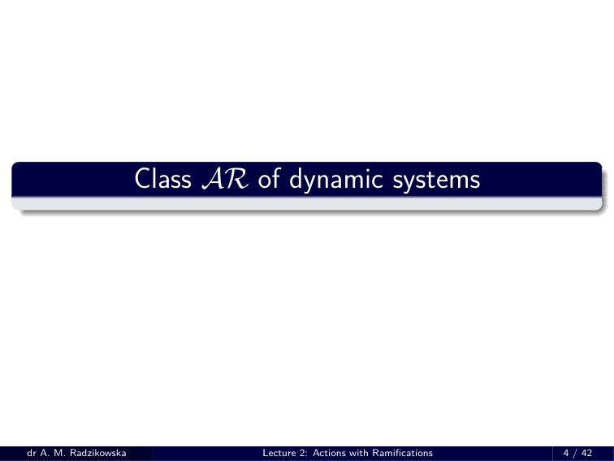
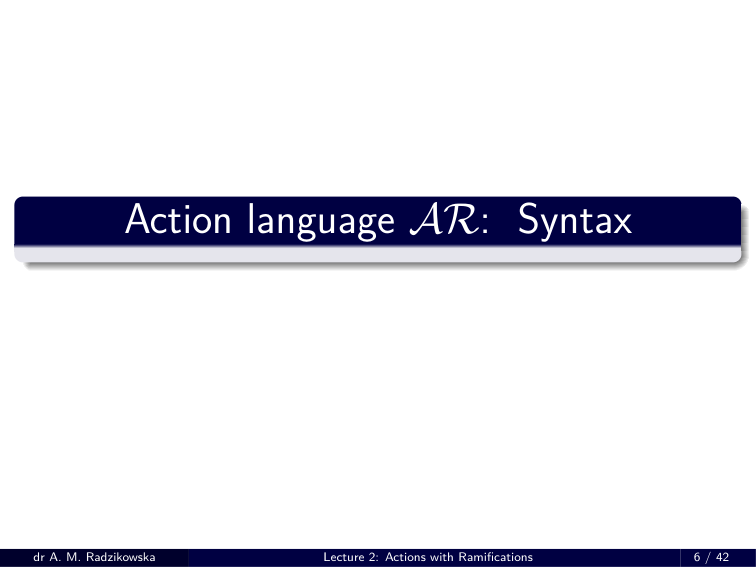
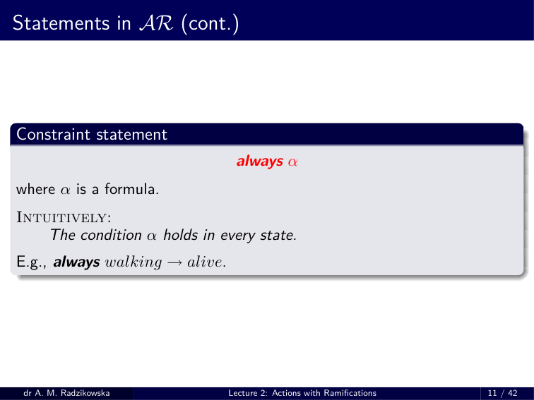
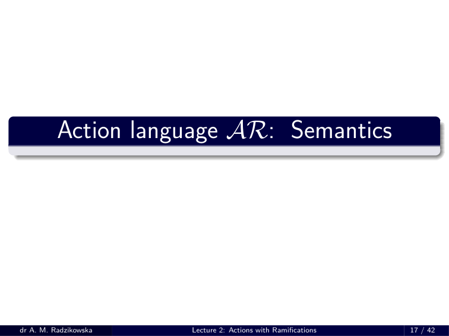
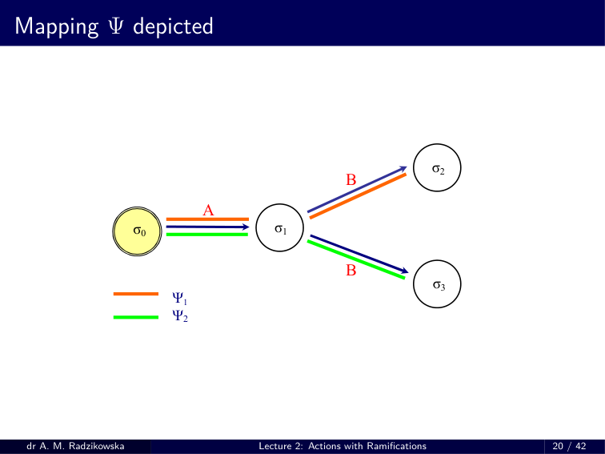
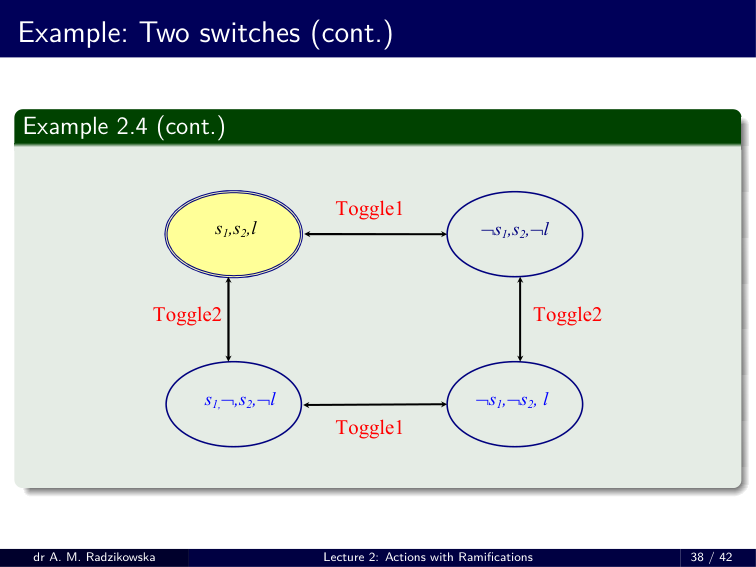

# RW 02 – HANDOUT

> Source: `RW_02___HANDOUT.pdf`

---

## Knowledge Representation

---

## Outline

1. Dynamic systems with actions’ ramifications
2. Language *AR* – Action Language with Ramifications
  - Statements in *AR*
  - Representations in *AR*
  - Semantics of *AR*
  - Example

---

## Ramification problem

### Ramification problem (Finger, 1987)

- Concerns the problem of concisely representing indirect effects of actions (propagation of changes). It is usually unreasonable to explicity enumerate all of the consequences of actions.

### Example: Shooting action

- Assume that a turkey is walking. Then, as a consequence of a shooting action, it is not walking anymore. Thus *not walking* is a side effect of a shooting action.

---

## Class AR of dynamic systems

---

## Class of dynamic systems with ramifications

### Basic assumptions

  - Inertia law.
  - Complete information about all actions and all fluents.
  - Nondeterminism is allowed.
  - Side effects (ramifications) of actions are admitted.
  - Action can be unexecutable is some states.
  - If an action precondition does not hold, the execution of the action has no effect.

### Language *AR*

- To represent this class of dynamic systems we will use action languages of the class *AR* .

---

## Action language AR: Syntax

---

## Action Language *AR* : Syntax

### Preliminaries

  - ***Signature:*** Υ = ( *F , A c* ) , *F I ⊆F* ( ***inertial fluents*** ).
  - ***Formula:*** any propositional statement:
    - *α* ::= *f |¬ α | α ∧ β | α ∨ β | α → β | α ↔ β.*
  - Two specific formulas: *⊤* (truth) and *⊥* (falsity).

---

## Statements in *AR*

### Value statements

    - *α* ***after*** A 1 *, . . . ,* A *n*
    - ***observable*** *α* ***after*** A 1 *, . . .* ,A *n*
- where *α* is a formula, A *i ∈A c* , *i* = 1 *, . . . , n* , are actions.
- Intuitive meaning:
  - *The* 1 *st statement: the condition α always holds after performing* *the sequence* A 1 *, . . . ,* A *n of actions.* *The* 2 *nd statement: the condition α sometimes (may) holds after* *performing the sequence* A 1 *, ...,* A *n of actions.*
- If *n* = 0 , then we use the abbreviation ***initially*** *α* .

---

## Statements in *AR* (cont.)

### Effect statements

    - A ***causes*** *α* ***if*** *π*
- where *α, π* are formulas and A *∈A c* .
- Intuitive meaning:
  - *Performing the action* A *in any state satisfying π leads to a state* *where α holds.*
- Abbreviations:
  - If *π ⇔⊤* :
    - A ***causes*** *α* .
  - If *α ⇔⊥* :
    - ***impossible*** A ***if*** *π* .

---

## Statements in *AR* (cont.)

### Release statement

    - A ***releases*** *f* ***if*** *π*
- where A *∈A c* , *f ∈F I* , and *π* is a formula.
- Intuitively:
  - *Performing the action* A *in any state satisfying π might , but need* *not , change the value of the inertial fluent f .*
- Abbreviation:
  - if *π ⇔⊤* , we write A ***releases*** *f* .
- E.g., Toss ***releases*** *heads* .

---

## Statements in AR (cont.)

---

## Statements in *AR* (cont.)

### Fluent specification statement

    - ***noninertial*** *f*
- where *f ̸∈F I* .
- Intuitively:
  - *A fluent f in noninertial whenever it is out of minimization of* *changes.*

### Action domain

- A finite set of statements of *AR* is called an ***action domain*** .

---

## Modification of Yale Shooting Problem

### Example 2.1

  - *There is a shooter Bill and a turkey Fred. Bill can load the gun,* *which makes it loaded. He can also shoot the gun which makes* *the gun unloaded and, in addition, makes Fred dead id the gun* *was loaded. Initially, the gun was unloaded and Fred is walking.* *Clearly, whenever Fred is walking, it is alive.*
- Representation in *AR* :
    - ***initially*** *¬ loaded ∧ walking* ; ***always*** *walking → alive* ; Load ***causes*** *loaded* ; Shoot ***causes*** *¬ loaded* ; Shoot ***causes*** *¬ alive* ***if*** *loaded* .

---

## Russian Turkey Scenario

### Example 2.2

  - *There is a shooter Bill and a turkey Fred. Bill can load the gun,* *which makes it loaded. Bill can also spin the gun, which randomly* *makes it unloaded. Shooting the gun makes it unloaded and, if the* *gun was loaded, makes Fred dead. Initially the gun was unloaded* *and Fred was alive.*
- Representation in *AR* :
    - ***initially*** *¬ loaded ∧ alive* ; Load ***causes*** *loaded* ; Shoot ***causes*** *¬ loaded* ; Shoot ***causes*** *¬ alive* ***if*** *loaded* ; Spin ***releases*** *loaded* ***if*** *loaded* .

---

## Opening the door

### Example 2.3

  - *Inserting a card makes the door open. If one has no card, it is not* *possible to insert it. Initially the door are closed.*
- Representation in *AR* :
    - ***initially*** *¬ open* ; InsertCard ***causes*** *open* ; ***impossible*** InsertCard ***if*** *¬ hasCard* .

---

## Two switches

### Example 2.4

  - *There are two switches, which can be in the position on or off. If* *both switches are in the same position, the light is on, otherwise* *it is off. Pressing a switch makes it changed its position.*
- Representation in *AR* :
    - ***noninertial*** *light* ; ***always*** *light ↔* ( *switch* 1 *↔ switch* 2 ) ; Toggle1 ***causes*** *switch* 1 ***if*** *¬ switch* 1 ; Toggle1 ***causes*** *¬ switch* 1 ***if*** *switch* 1 ; Toggle2 ***causes*** *switch* 2 ***if*** *¬ switch* 2 ; Toggle2 ***causes*** *¬ switch* 2 ***if*** *switch* 2 .

---

## Action language AR: Semantics

---

## Semantics of *AR*

### Structure

- A ***structure*** for a language *L* of the class *AR* is a triple *S* = (Σ *, σ* 0 *, Res* ) where
  - Σ *̸* = *∅* is a set of states,
  - *σ* 0 *∈* Σ is the initial state,
  - *Res* : *A c ×* Σ *→* 2 Σ is a transition function.
- Intuitively, for any action *A ∈A c* and for any state *σ ∈* Σ , *Res* assigns all states accessible from *σ* by performing A.
- Moreover,
  - *Res* ( *A, σ* ) are all such states, which are “as close as possible” to *σ* ;
  - Σ is the set of states satisfying all constraints.

---

## Semantics of *AR* (cont.)

### Transition function

- Let *S* = (Σ *, σ* 0 *, Res* ) be a structure. Define a partial mapping Ψ *S* : *A c ∗ ×* Σ *→* Σ as follows
  - Ψ *S* ( *ε, σ* ) = *σ*
  - if Ψ *S* (( A 1 *, . . . ,* A *n* ) *, σ* ) , *n* ⩾ 1 , is defined, then Ψ *S* (( A 1 *, . . . ,* A *n* ) *, σ* ) *∈ Res* ( A *n ,* Ψ *S* (( A 1 *, . . . ,* A *n −* 1 ) *, σ* ))

---

## Mapping Ψ depicted

---

## Semantics of *AR* (cont.)

- Let *D* be an action domain and let *S* = (Σ *, σ* 0 *, Res* ) be a structure for *AR* .

### Inertial fluent

- A fluent *f* is ***inertial*** iff ( ***noninertial*** *f* ) *̸∈ D* .

### State for *D*

- A state *σ* : *F →{* 0 *,* 1 *}* is a ***state for*** *D* ifffor every constraint ( ***always*** *α* ) *∈ D* , it holds *σ |* = *α* .

### Satisfiability of value statements

  - A value statement ( *α* ***after*** A 1 *, . . . ,* A *n* ) is ***true*** in *S* iff Ψ *S* (( A 1 *, . . . ,* A *n* ) *, σ* 0 ) *|* = *α* for **every** mapping Ψ *S* defined before.
  - An observation statement ( ***observable*** *α* ***after*** A 1 *, . . . ,* A *n* ) is ***true*** in *S* iff Ψ *S* (( A 1 *, . . . ,* A *n* ) *, σ* 0 ) *|* = *α* for **some** mapping Ψ *S* defined as before.

---

## Semantics of *AR* – functions *Res* and *New*

- Let *D* be an action domain and let *S* = (Σ *, σ* 0 *, Res* ) be a structure for a language *L* of the class *AR* .
- Auxiliary function *Res* 0
- Define the auxiliary function *Res* 0 : *A c ×* Σ *→* 2 Σ as follows: for every A *∈A c* and for every *σ ∈* Σ ,
- *Res* 0 ( A *, σ* ) = *{ σ ′ ∈* Σ : ( *A* ***causes*** *α* ***if*** *π* ) *∈ D* & ( *σ |* = *π* ) = *⇒* ( *σ ′ |* = *α* ) *} .*

### Function *New*

- For every *σ ∈* Σ , for every A *∈A c* , and for every *σ ′ ∈ Res* 0 ( *A, σ* ) , *New* ( A *, σ, σ ′* ) is the set of literals *f* such that *σ ′ |* = *f* and
1. *f ∈F I* and *σ* ( *f* ) *̸* = *σ ′* ( *f* ) , or
2. there is a statement ( A ***releases*** *f* ***if*** *π* ) *∈ D* and *σ |* = *π* .

---

## Semantics of *AR* – model

### Model

- Let *D* be an action domain in a language *L* of the class *AR* and let *S* = (Σ *, σ* 0 *, Res* ) be a structure for *L* . We say that *S* is a ***model*** of *D* iff
- **(M1)** Σ is the set of all states for *D* ;
- **(M2)** every value statement and every observation statement in *D* is true
  - in *S* ;
- **(M3)** for every A *∈A c* and for every *σ ∈* Σ , *Res* ( A *, σ* ) is the set of all
  - states *σ ′ ∈* Σ fo which the sets *New* ( A *, σ, σ ′* ) are minimal wrt set inclusion.

---

## Example: YSP

### Example 2.1 (cont.)

- Recall the YSP:
    - ***initially*** *¬ loaded ∧ walking* ; ***always*** *walking → alive* ; Load ***causes*** *loaded* ; Shoot ***causes*** *¬ loaded* ; Shoot ***causes*** *¬ alive* ***if*** *loaded* .
- Here we have Σ = *{ σ* 0 *, σ* 1 *, σ* 2 *, σ* 3 *, σ* 4 *, σ* 5 *}* where
    - *σ* 0 = *{ a, ¬ l, w }*
    - *σ* 3 = *{ a, l, w }*
    - *σ* 1 = *{ a, ¬ l, ¬ w }*
    - *σ* 4 = *{ a, l, ¬ w }*
    - *σ* 2 = *{¬ a, ¬ l, ¬ w }*
    - *σ* 5 = *{¬ a, l, ¬ w }* .

---

## Example: YSP (cont.)

### Example 2.1 (cont.)

    - *σ* 0 = *{ a, ¬ l, w }*
    - *σ* 3 = *{ a, l, w }*
    - *σ* 1 = *{ a, ¬ l, ¬ w }*
    - *σ* 4 = *{ a, l, ¬ w }*
    - *σ* 2 = *{¬ a, ¬ l, ¬ w }*
    - *σ* 5 = *{¬ a, l, ¬ w }* .
- *Res* 0 ( Load *, σ* 0 ) = *Res* 0 ( Load *, σ* 1 ) = *Res* 0 ( Load *, σ* 2 ) = *{ σ* 3 *, σ* 4 *, σ* 5 *}* .
    - * *New* ( Load *, σ* 0 *, σ* 3 ) = *{ l }* *New* ( Load *, σ* 0 *, σ* 4 ) = *{ l, ¬ w }* *New* ( Load *, σ* 0 *, σ* 5 ) = *{¬ a, l, ¬ w }*
    - *Res* ( Load *, σ* 0 ) = *{ σ* 3 *}* .

---

## Example: YSP (cont.)

### Example 2.1 (cont.)

    - *σ* 0 = *{ a, ¬ l, w }*
    - *σ* 3 = *{ a, l, w }*
    - *σ* 1 = *{ a, ¬ l, ¬ w }*
    - *σ* 4 = *{ a, l, ¬ w }*
    - *σ* 2 = *{¬ a, ¬ l, ¬ w }*
    - *σ* 5 = *{¬ a, l, ¬ w }* .
- *Res* 0 ( Load *, σ* 1 ) = *{ σ* 3 *, σ* 4 *, σ* 5 *}* .
    - *New* ( Load *, σ* 1 *, σ* 3 ) = *{ l, w }* * *New* ( Load *, σ* 1 *, σ* 4 ) = *{ l }* *New* ( Load *, σ* 1 *, σ* 5 ) = *{¬ a, l }*
    - *Res* ( Load *, σ* 1 ) = *{ σ* 4 *}* .

---

## Example: YSP (cont.)

### Example 2.1 (cont.)

    - *σ* 0 = *{ a, ¬ l, w }*
    - *σ* 3 = *{ a, l, w }*
    - *σ* 1 = *{ a, ¬ l, ¬ w }*
    - *σ* 4 = *{ a, l, ¬ w }*
    - *σ* 2 = *{¬ a, ¬ l, ¬ w }*
    - *σ* 5 = *{¬ a, l, ¬ w }* .
- *Res* 0 ( Load *, σ* 2 ) = *{ σ* 3 *, σ* 4 *, σ* 5 *}* .
    - *New* ( Load *, σ* 2 *, σ* 3 ) = *{ a, l, w }* *New* ( Load *, σ* 2 *, σ* 4 ) = *{ a, l }* * *New* ( Load *, σ* 2 *, σ* 5 ) = *{ l }*
    - *Res* ( Load *, σ* 2 ) = *{ σ* 5 *}* .

---

## Example: YSP (cont.)

### Example 2.1 (cont.)

    - *σ* 0 = *{ a, ¬ l, w }*
    - *σ* 3 = *{ a, l, w }*
    - *σ* 1 = *{ a, ¬ l, ¬ w }*
    - *σ* 4 = *{ a, l, ¬ w }*
    - *σ* 2 = *{¬ a, ¬ l, ¬ w }*
    - *σ* 5 = *{¬ a, l, ¬ w }* .
    - *Res* 0 ( Load *, σ* 3 ) = *{ σ* 3 *, σ* 4 *, σ* 5 *}*
    - * *New* ( Load *, σ* 3 *, σ* 3 ) = *∅* *New* ( Load *, σ* 3 *, σ* 4 ) = *{¬ w }* *New* ( Load *, σ* 3 *, σ* 5 ) = *{¬ a, ¬ w }*
    - *Res* ( Load *, σ* 3 ) = *{ σ* 3 *}* .

---

## Example: YSP (cont.)

### Example 2.1 (cont.)

    - *σ* 0 = *{ a, ¬ l, w }*
    - *σ* 3 = *{ a, l, w }*
    - *σ* 1 = *{ a, ¬ l, ¬ w }*
    - *σ* 4 = *{ a, l, ¬ w }*
    - *σ* 2 = *{¬ a, ¬ l, ¬ w }*
    - *σ* 5 = *{¬ a, l, ¬ w }* .
- Similarly,
    - *Res* 0 ( Load *, σ* 4 ) = *Res* 0 ( Load *, σ* 5 ) = *{ σ* 3 *, σ* 4 *, σ* 5 *} .*
- Therefore,
    - *Res* ( Load *, σ* 4 ) = *{ σ* 4 *}* *Res* ( Load *, σ* 5 ) = *{ σ* 5 *}* .

---

## Example: YSP (cont.)

### Example 2.1 (cont.)

    - *σ* 0 = *{ a, ¬ l, w }*
    - *σ* 3 = *{ a, l, w }*
    - *σ* 1 = *{ a, ¬ l, ¬ w }*
    - *σ* 4 = *{ a, l, ¬ w }*
    - *σ* 2 = *{¬ a, ¬ l, ¬ w }*
    - *σ* 5 = *{¬ a, l, ¬ w }* .
- *Res* 0 ( shoot *, σ* 0 ) = *Res* 0 ( Shoot *, σ* 1 ) = *Res* 0 ( Shoot *, σ* 2 ) = *{ σ* 0 *, σ* 1 *, σ* 2 *}*
    - * *New* ( shoot *, σ* 0 *, σ* 0 ) = *∅* *Res* 0 ( Shoot *, σ* 0 *, σ* 1 ) = *{¬ w }* *Res* 0 ( Shoot *, σ* 0 *, σ* 2 ) = *{¬ a, ¬ w }*
    - *Res* ( shoot *, σ* 0 ) = *{ σ* 0 *}* .
- Analogously, we can easily calculate
    - *Res* ( shoot *, σ* 1 ) = *{ σ* 1 *}* *Res* ( shoot *, σ* 2 ) = *{ σ* 2 *}* .

---

## Example: YSP (cont.)

### Example 2.1 (cont.)

    - *σ* 0 = *{ a, ¬ l, w }*
    - *σ* 3 = *{ a, l, w }*
    - *σ* 1 = *{ a, ¬ l, ¬ w }*
    - *σ* 4 = *{ a, l, ¬ w }*
    - *σ* 1 = *{¬ a, ¬ l, ¬ w }*
    - *σ* 5 = *{¬ a, l, ¬ w }* .
    - *Res* 0 ( Shoot *, σ* 3 ) = *{ σ* 2 *} .*
- So we immediately get *Res* ( Shoot *, σ* 3 ) = *{ σ* 2 *}* . Analogously,
    - *Res* 0 ( Shoot *, σ* 4 ) = *Res* 0 ( Shoot *, σ* 5 ) = *{ σ* 2 *} ,*
- so *Res* ( Shoot *, σ* 4 ) = *Res* ( Shoot *, σ* 5 ) = *{ σ* 2 *}* .

---

## Example: YSP (cont.)

### Example 2.1 (cont.)

  - σ 0 σ 1
    - Shoot
    - Shoot
    - Load
    - Load
    - Shoot
    - *a* ,¬ *l* , *w*
    - *a* , *l* , *w*
    - ¬ *a* ,¬ *l* ,¬ *w*
    - σ 2
    - σ 3
    - Shoot
    - Shoot
    - Load
    - Load
    - σ 4
    - *a* , ¬ *l* , ¬ *w*
    - *a* , *l* , ¬ *w*
    - ¬ *a* , *l* ,¬ *w*
    - σ 5
    - Shoot
    - Load
    - Load

---

## Example: Two switches (cont.)

### Example 2.4 (cont.)

- Recall
  - *There are two switches, which can be in the position on or off. If* *both switches are in the same position, the light is on, otherwise* *it is off. Pressing any switch changes its position.*
- Representation in *AR* :
    - ***noninertial*** *light* ; ***initially*** *switch* 1 *∧ switch* 2 ; ***always*** *light ↔* ( *switch* 1 *↔ switch* 2 ) ; Toggle1 ***causes*** *¬ switch* 1 ***if*** *switch* 1 ; Toggle1 ***causes*** *switch* 1 ***if*** *¬ switch* 1 ; Toggle2 ***causes*** *¬ switch* 2 ***if*** *switch* 2 ; Toggle2 ***causes*** *switch* 2 ***if*** *¬ switch* 2 ;

---

## Example: Two switches (cont.)

### Example 2.4 (cont.)

- Here we have Σ = *{ σ* 0 *, σ* 1 *, σ* 2 *, σ* 3 *}* where
- *σ* 0 = *{ switch* 1 *, switch* 2 *, light }*
    - *σ* 2 = *{ switch* 1 *, ¬ switch* 2 *, ¬ light }*
- *σ* 1 = *{¬ switch* 1 *, ¬ switch* 2 *, light }*
    - *σ* 3 = *{¬ switch* 1 *, switch* 2 *, ¬ light }* .
- Assume that all fluents are inertial. Then
    - *Res* 0 ( *Toggle* 1 *, σ* 0 ) = *{ σ* 1 *, σ* 3 *}*
    - * *New* ( Toggle1 *, σ* 0 *, σ* 1 ) = *{¬ switch* 1 *, ¬ switch* 2 *}* * *New* ( Toggle1 *, σ* 0 *, σ* 3 ) = *{¬ switch* 1 *, ¬ light }*
    - *Res* ( Toggle1 *, σ* 0 ) = *{ σ* 1 *, σ* 3 *}* .
- So Toggle1 in *σ* 0 is non-deterministic, but the resulting state *σ* 1 is counterintuitive!

---

## Example: Two switches (cont.)

### Example 2.4 (cont.)

- *σ* 0 = *{ switch* 1 *, switch* 2 *, light }*
    - *σ* 2 = *{ switch* 1 *, ¬ switch* 2 *, ¬ light }*
- *σ* 1 = *{¬ switch* 1 *, ¬ switch* 2 *, light }*
    - *σ* 3 = *{¬ switch* 1 *, switch* 2 *, ¬ light }* .
- Similarly
    - *Res* 0 ( Toggle1 *, σ* 1 ) = *{ σ* 0 *, σ* 2 *}* * *New* ( Toggle1 *, σ* 1 *, σ* 0 ) = *{ switch* 1 *, switch* 2 *}* * *New* ( Toggle1 *, σ* 1 *, σ* 2 ) = *{ switch* 1 *, ¬ light }* .
    - *Res* ( Toggle1 *, σ* 1 ) = *{ σ* 0 *, σ* 2 *}* .
- Note that only the resulting state *σ* 2 coincides with our intuition.

---

## Example: Two switches (cont.)

### Example 2.4 (cont.)

- *σ* 0 = *{ switch* 1 *, switch* 2 *, light }*
    - *σ* 2 = *{ switch* 1 *, ¬ switch* 2 *, ¬ light }*
- *σ* 1 = *{¬ switch* 1 *, ¬ switch* 2 *, light }*
    - *σ* 3 = *{¬ switch* 1 *, switch* 2 *, ¬ light }* .
- Now let the fluent *light* be noninertial. Then
    - *Res* 0 ( Toggle1 *, σ* 0 ) = *{ σ* 1 *, σ* 3 *}*
    - *New* ( Toggle1 *, σ* 0 *, σ* 1 ) = *{¬ switch* 1 *, ¬ switch* 2 *}* * *New* ( Toggle1 *, σ* 0 *, σ* 3 ) = *{¬ switch* 1 *}*
    - *Res* ( Toggle1 *, σ* 0 ) = *{ σ* 3 *}* .
- Although *σ* 0 ( *light* ) *̸* = *σ* 3 ( *light* ) , we have *light ̸∈F I* (noninertial), so *¬ light ̸∈ New* ( Toggle1 *, σ* 0 *, σ* 3 ) .

---

## Example: Two switches (cont.)

### Example 2.4 (cont.)

- *σ* 0 = *{ switch* 1 *, switch* 2 *, light }*
    - *σ* 2 = *{ switch* 1 *, ¬ switch* 2 *, ¬ light }*
- *σ* 1 = *{¬ switch* 1 *, ¬ switch* 2 *, light }*
    - *σ* 3 = *{¬ switch* 1 *, switch* 2 *, ¬ light }* .
- Also
    - *Res* 0 ( Toggle1 *, σ* 1 ) = *{ σ* 0 *, σ* 2 *}* *New* ( Toggle1 *, σ* 1 *, σ* 0 ) = *{ switch* 1 *, switch* 2 *}* * *New* ( Toggle1 *, σ* 1 *, σ* 2 ) = *{ switch* 1 *}*
    - *Res* ( Toggle1 *, σ* 1 ) = *{ switch* 2 *}* .

---

## Example: Two switches (cont.)

---

## Example: Buying a paper

### Example 2.5

- Consider an action BuyPaper which causes that an agent has a paper *A* ( *HasA* ) **or** a paper *B* ( *hasB* ).
    - BuyPaper ***causes*** *hasA ∨ hasB* .
- Put
    - *σ* 0 = *{¬ hasA, ¬ hasB }*
    - *σ* 2 = *{ hasA, ¬ hasB }*
    - *σ* 1 = *{¬ hasA, hasB }*
    - *σ* 3 = *{ hasA, hasB }* .
- Then
    - *Res* 0 ( BuyPaper *, σ* 0 ) = *{ σ* 1 *, σ* 2 *, σ* 3 *}* * *New* ( BuyPaper *, σ* 0 *, σ* 1 ) = *{ hasB }* * *New* ( BuyPaper *, σ* 0 *, σ* 2 ) = *{ hasA }* *New* ( BuyPaper *, σ* 0 *, σ* 3 ) = *{ hasA, hasB }*
    - *Res* ( BuyPaper *, σ* 0 ) = *{ σ* 1 *, σ* 2 *}* .

---

## Example: Buying a paper (cont.)

### Example 2.5 (cont.)

- Problem:
  - *How to obtain the effect of this action such that an agent has* *both papers?*
- Possible solution:
    - BuyPaper ***causes*** *hasA ∨ hasB* ; BuyPaper ***releases*** *hasA* ***if*** *¬ hasA* ; BuyPaper ***releases*** *hasB* ***if*** *¬ hasB* .

---

## Example: Buying a paper (cont.)

### Example 2.5 (cont.)

    - *σ* 0 = *{¬ hasA, ¬ hasB }*
    - *σ* 2 = *{ hasA, ¬ hasB }*
    - *σ* 1 = *{¬ hasA, hasB }*
    - *σ* 3 = *{ hasA, hasB }* .
- So we get:
    - *Res* 0 ( BuyPaper *, σ* 0 ) = *{ σ* 1 *, σ* 2 *, σ* 3 *}*
    - * *New* ( BuyPaper *, σ* 0 *, σ* 1 ) = *{¬ hasA, hasB }* * *New* ( BuyPaper *, σ* 0 *, σ* 2 ) = *{ hasA, ¬ hasB }* * *New* ( BuyPaper *, σ* 0 *, σ* 3 ) = *{ hasA, hasB }*
    - *Res* ( BuyPaper *, σ* 0 ) = *{ σ* 1 *, σ* 2 *, σ* 3 *}* .

---

## Thank you for your attention!

---

