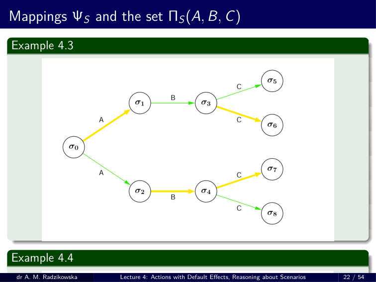
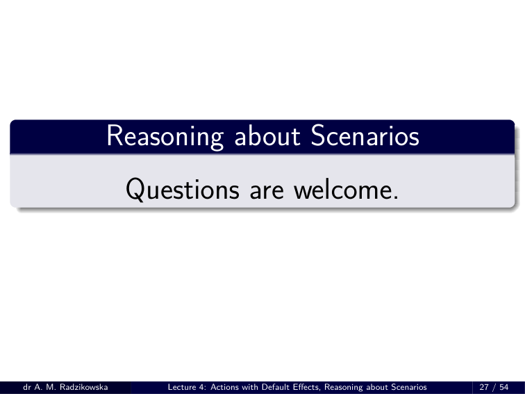

# RW 04 – HANDOUT

> Source: `RW_04___HANDOUT.pdf`

---

## Knowledge Representation

    - **Lecture 4:**
  - **Actions with Default Effects, Reasoning about Scenarios**
    - **dr Anna Maria Radzikowska**
    - Warsaw University of Technology
    - Faculty of Mathematics and Information Science
    - Building MiNI PW, room 504
    - E-mail: Anna.Radzikowska@pw.edu.pl
    - Warsaw 2026

---

## Outline

1. Certain and default effects
2. Action Language *AD*
  - Basic assumptions
  - Syntax
  - Semantics
3. Query Languages
  - Abnormality measure
4. Example
5. Reasoning about Scenarios
  - Basic assumptions
6. Action Language *AL*
  - Syntax: Statements and Action Scenarios
  - Semantics
7. Query Language
  - Satisfiability
8. Example

---

## Certain and default effects

  - Actions we have considered recently, deterministic or non–deterministic, have a common feature – their effects were **certain** . No preferences (expectations) were involved.
  - In real–life problems actions usually have also **default** (expected, preferred) effects. They are not certain and in some (atypical) cases they need not occur.

### Example: Two shooting actions

1. Shooting the gun (by Bill) ***always*** makes it unloaded and, if the gun was loaded before the action, makes Fred dead.
2. Shooting the gun (by Jim) ***always*** makes it unloaded and, if the gun was loaded before, it ***typically*** makes Fred dead.

---

## Default effects

### General assumption

  - **Unless otherwise is known, assume that typical effects occur.**

### Qualification problem

- Default effects might be also viewed from the standpoint of the qualification problem: since it is in general impossible to enumerate all conditions under which the action is performed successfully and brings given results, we state that it ***usually*** has these results under specified (not necessary completely) conditions.

---

## Basic assumptions

### Dynamic systems with defaults

  - Inertia law.
  - Complete information about all actions and all fluents.
  - Non–determinism.
  - Side effects (ramifications) of actions are admitted.
  - Action can be unexecutable is some states.
  - Actions may have ***certain*** or ***typical*** (preferable) effects.

### Action Language *AD*

- To represent this class of dynamic systems we will use action languages of the class *AD* .

---

## Action Language *AD* – Statements

### Signature

- A ***signature*** is a pair Υ = ( *F , A c* ) defined as before.

### Statements

- The set of statements in *AD* is that of *AR* extended by the ***typical effect*** ***statement*** of the form:
    - *A* ***typically causes*** *α* ***if*** *π*
- Intuitively: the action *A* , whenever performed in a state satisfying *π* , ***typically*** leads to a state satisfying *α* . The effect *α* is ***preferred*** – in contrast to nondeterministic effects, where none result is preferred.
- E.g. Shoot ***typically causes*** *¬ alive* ***if*** *loaded* .

---

## Action Language *AD* – Semantics

### State

- A ***state*** is a mapping *σ* : *F →{* 0 *,* 1 *}* . As before, *σ |* = *α* means that *α* holds in *σ* (or *σ* is a model of *α* ).

### Structure

- A ***structure*** for *AD* is a tuple *S* = (Σ *, σ* 0 *, ResAb , ResN* ) where
  - Σ is a set of states;
  - *σ* 0 *∈* Σ is the initial state;
  - *ResAb , ResN* : *A c ×* Σ *→* 2 Σ are transition functions; *ResAb* and *ResN* are an ***atypical transition*** and a ***typical transition*** functions, respectively.

---

## Action Language *AD* – Semantics (cont.)

- Let *D* be an action domain in *AD* and let *S* = (Σ *, σ* 0 *, ResAb , ResN* ) be a structure for *AD* .

### States of *D*

- A state *σ* is a ***state of*** *D* iff *σ |* = *α* for every constraint ( ***always*** *α* ) in *D* .

### Ψ mapping

- Let *A ∈A c* and let *σ* . Put *Res* ( *A , σ* ) = *ResAb* ( *A , σ* ) *∪ ResN* ( *A , σ* ). Define Ψ *S* : *A c ∗ ×* Σ *→* Σ as follows:
  - Ψ *S* ( *ε, σ* ) = *σ* ;
  - if Ψ *S* (( *A* 1 *, . . . , A n* ) *, σ* ) is defined, then Ψ *S* (( *A* 1 *, . . . , A n* ) *, σ* ) *∈ Res* ( *A n ,* Ψ *S* (( *A* 1 *, . . . , A n −* 1 ) *, σ* )).

---

## Action Language *AD* – Semantics (cont.)

### Satisfiability of value statements

  - A value statement *α* ***after*** *A* 1 *, . . . , A n* is ***true*** in *S* ifffor **every** mapping Ψ *S* defined before, if Ψ *S* (( *A* 1 *, . . . , A n* ) *, σ* 0 ) is defined, then Ψ *S* (( *A* 1 *, . . . , A n* ) *, σ* 0 ) *|* = *α* .
  - An observation statement ***observable*** *α* ***after*** *A* 1 *, . . . , A n* is ***true*** in *S* ifffor **some** mapping Ψ *S* ,
    - Ψ *S* (( *A* 1 *, . . . , A n* ) *, σ* 0 ) is defined;
    - Ψ *S* (( *A* 1 *, . . . , A n* ) *, σ* 0 ) *|* = *α* .

---

## Action Language *AD* – Semantics (cont.)

### Auxiliary functions

  - *Res* 0 : *A c ×* Σ *→* 2 Σ is defined wrt ***effect statements*** : for every *A ∈A c* and for every state *σ ∈* Σ, *Res* 0 ( *A , σ* ) is the set of all states *σ ′ ∈* Σ satisfying:
    - ( A ***causes*** *α* ***if*** *π* ) *∈ D* & ( *σ |* = *π* ) = *⇒ σ ′ |* = *α.*
  - *Res −* : *A c ×* Σ *→* 2 Σ is defined wrt minimization of changes, i.e., for every action *A ∈A c* and for every state *σ ∈* Σ, *Res −* ( *A , σ* ) is the set of all states *σ ′ ∈ Res* 0 ( *A , σ* ) for which the sets *New* ( *A , σ, σ ′* ) are minimal (wrt set inclusion).
  - *Res* + 0 : *A c ×* Σ *→* 2 Σ is defined as follows: for any *A ∈A c* and for any *σ ∈* Σ, *Res* +
  0. ( *A , σ* ) is the set of states *σ ′ ∈ Res* 0 ( *A , σ* ) such that
    - ( A ***typically causes*** *α* ***if*** *π* ) *∈ D* & ( *σ |* = *π* ) = *⇒* ( *σ ′ |* = *α* ) *.*
  - *Res* + 0 ( *A , σ* ) contains states where both certain and typical effects of *A* hold.

---

## Action Language *AD* – Models

### Model

- Let *D* be an action domain of *AD* . a structure *S* = (Σ *, σ* 0 *, ResAb , ResN* ) is a ***model*** of *D* iff
1. Σ is the set of all states of *D* ;
2. All value statements and all observation statements in *D* are true in *S* ;
3. For every A *∈A c* and for every *σ ∈* Σ,
    - *ResN* ( A *, σ* ) = *{ σ ′ ∈ Res* +
  0. ( A *, σ* ) : *New* ( A *, σ, σ ′* ) are minimal *}*
  - *ResAb* ( A *, σ* ) = *Res −* ( A *, σ* ) *\ ResN* ( A *, σ* ) *.*
  - *ResN* is the set of all expected states (wrt minimal changes) satisfying both certain and typical effects, while *ResAb* is the set of expected states, where only certain effects hold.

---

## Example: Modification of YSP

### Example 4.1

    - ***initially*** *alive ∧¬ loaded* ; Load ***causes*** *loaded* ; Shoot ***causes*** *¬ loaded* ; shoot ***typically causes*** *¬ alive* ***if*** *loaded* .
- Σ = *{ σ* 0 *, σ* 1 *, σ* 2 *, σ* 3 *}* where
    - *σ* 0 = *{ alive , ¬ loaded }*
    - *σ* 2 = *{¬ alive , ¬ loaded }*
    - *σ* 1 = *{ alive , loaded }*
    - *σ* 3 = *{¬ alive , loaded } .*
    - *Res* 0 ( Shoot *, σ* 0 ) = *{ σ* 0 *, σ* 2 *}* *Res −* ( Shoot *, σ* 0 ) = *{ σ* 0 *}* *Res* + 0 ( Shoot *, σ* 0 ) = *{ σ* 0 *, σ* 2 *}* *ResN* ( Shoot *, σ* 0 ) = *{ σ* 0 *}* *ResAb* ( Shoot *, σ* 0 ) = *∅* .

---

## Modification of YSP (cont.)

### Example 4.1

    - *σ* 0 = *{ alive , ¬ loaded }*
    - *σ* 2 = *{¬ alive , ¬ loaded }*
    - *σ* 1 = *{ alive , loaded }*
    - *σ* 3 = *{¬ alive , loaded } .*
    - *Res* 0 ( Load *, σ* 0 ) = *{ σ* 1 *, σ* 3 *}* *Res −* ( Load *, σ* 0 ) = *{ σ* 1 *}* *Res* + 0 ( Load *, σ* 0 ) = *{ σ* 1 *, σ* 3 *}* *ResN* ( Load *, σ* 0 ) = *{ σ* 1 *}* *ResAb* ( Load *, σ* 0 ) = *∅* .

### Note that whenever an action has certain effects only, they are viewed as **typical** .

---

## Modification of YSP (cont.)

### Example 4.1

    - *σ* 0 = *{ alive , ¬ loaded }*
    - *σ* 2 = *{¬ alive , ¬ loaded }*
    - *σ* 1 = *{ alive , loaded }*
    - *σ* 3 = *{¬ alive , loaded } .*
    - *Res* 0 ( Load *, σ* 1 ) = *{ σ* 1 *, σ* 3 *}* *Res −* ( Load *, σ* 1 ) = *{ σ* 1 *}* *Res* + 0 ( Load *, σ* 1 ) = *{ σ* 1 *, σ* 3 *}* *ResN* ( Load *, σ* 1 ) = *{ σ* 1 *}* *ResAb* ( Load *, σ* 0 ) = *∅* .
    - *Res* 0 ( Shoot *, σ* 1 ) = *{ σ* 0 *, σ* 2 *}* *Res −* ( Shoot *, σ* 1 ) = *{ σ* 0 *}* *Res* + 0 ( Shoot *, σ* 1 ) = *{ σ* 2 *}* *ResN* ( Shoot *, σ* 1 ) = *{ σ* 2 *}* *ResAb* ( Shoot *, σ* 0 ) = *{ σ* 0 *}* .

---

## Modification of YSP (cont.)

### Example 4.1

    - *σ* 0 = *{ alive , ¬ loaded }*
    - *σ* 2 = *{¬ alive , ¬ loaded }*
    - *σ* 1 = *{ alive , loaded }*
    - *σ* 3 = *{¬ alive , loaded } .*
    - *Res* 0 ( Load *, σ* 2 ) = *{ σ* 1 *, σ* 3 *}* *Res −* ( Load *, σ* 2 ) = *{ σ* 3 *}* *Res* + 0 ( Load *, σ* 2 ) = *{ σ* 1 *, σ* 3 *}* *ResN* ( Load *, σ* 2 ) = *{ σ* 3 *}* *ResAb* ( Load *, σ* 2 ) = *∅* .
    - *Res* 0 ( Shoot *, σ* 2 ) = *{ σ* 0 *, σ* 2 *}* *Res −* ( Shoot *, σ* 2 ) = *{ σ* 2 *}* *Res* + 0 ( Shoot *, σ* 2 ) = *{ σ* 0 *, σ* 2 *}* *ResN* ( Shoot *, σ* 2 ) = *{ σ* 2 *}* *ResAb* ( Shoot *, σ* 2 ) = *∅* .

---

## Modification of YSP (cont.)

### Example 4.1

    - *σ* 0 = *{ alive , ¬ loaded }*
    - *σ* 2 = *{¬ alive , ¬ loaded }*
    - *σ* 1 = *{ alive , loaded }*
    - *σ* 3 = *{¬ alive , loaded } .*
    - *Res* 0 ( Load *, σ* 3 ) = *{ σ* 1 *, σ* 3 *}* *Res −* ( Load *, σ* 3 ) = *{ σ* 3 *}* *Res* + 0 ( Load *, σ* 3 ) = *{ σ* 1 *, σ* 3 *}* *ResN* ( Load *, σ* 3 ) = *{ σ* 3 *}* *ResAb* ( Load *, σ* 3 ) = *∅* .
    - *Res* 0 ( Shoot *, σ* 3 ) = *{ σ* 0 *, σ* 2 *}* *Res −* ( Shoot *, σ* 3 ) = *{ σ* 2 *}* *Res* + 0 ( Shoot *, σ* 3 ) = *{ σ* 2 *}* *ResN* ( Shoot *, σ* 3 ) = *{ σ* 2 *}* *ResAb* ( Shoot *, σ* 3 ) = *∅* .

---

## Modification of YSP (cont.)

### Example 4.1

    - Shoot
    - Load
    - Load
    -  *load, alive*
    - *load, alive*
    - Shoot
    - Shoot
    - Shoot
    -  *load,*  *alive*
    - *load,*  *alive*
    - Load
    - Load Shoot
    - Typical effects
    - Atypical effects

---

## Problem

### Question

  - *Is it possible that an action has only atypical effects in some state?*

### Example 4.2

    - ***always*** *f ∨ g* ; A ***causes*** *¬ f* ; a ***typically causes*** *¬ g* ***if*** *f* .
  - *σ* 0 = *{ f , g }*
    - *Res* 0 ( *A , σ* 0 ) = *{ σ* 2 *}*
  - *σ* 1 = *{ f , ¬ g }*
    - *Res −* ( *A , σ* 0 ) = *{ σ* 2 *}*
    - *ResN* ( *A , σ* 0 ) = *∅*
  - *σ* 2 = *{¬ f , g }*
    - *Res* + 0 ( *A , σ* 0 ) = *∅*
    - *ResAb* ( *A , σ* 0 ) = *{ σ* 2 *}* .

---

## Queries in *AD*

    - *α* ***after*** *A* 1 *, . . . , A n*
    - ***typically*** *α* ***after*** *A* 1 *, . . . , A n*
- Intutively:
  - The 1st query states that *α* **always** holds after performind the sequence ( *A* 1 *, . . . , A n* ) of actions, regarless of the way the actions were executed, that is, in a typical or atypical way.
  - The 2nd query says that *α* **typically** holds after performing the sequence ( *A* 1 *, . . . , A n* ) of actions which is understood as **minimal** **atypical transitions** on paths determined by ( *A* 1 *, . . . , A n* ).

---

## Abnormality measure

### Penalty function

- Let *S* = (Σ *, σ* 0 *, ResAb , ResN* ) be a structure for *AD* . For any action *A ∈A c* and for any two states *σ, σ ′ ∈* Σ define
    -   
    - 0
    - iff *σ ′ ∈ ResN* ( *A , σ* )
    - 1
    - iff *σ ′ ∈ ResAb* ( *A , σ* )
    - + *∞*
    - otherwise
    - *κ S* ( *A , σ, σ ′* ) =
    -  

### Generalization for paths

- For any mapping Ψ *S* and for any sequence ( *A* 1 *, . . . , A n* ) of actions:
  - *K* Ψ *S* (( *A* 1 *, . . . , A n* ) *, σ* 0 ) = + *∞* iffΨ *S* (( *A* 1 *, . . . , A n* ) *, σ* 0 ) is undefined;
    - *n* X
  - *K* Ψ *S* (( *A* 1 *, . . . , A n* ) *, σ* 0 ) =
    - *i* =1 *κ S* ( *A i , σ i −* 1 *, σ i* ), *σ i* = Ψ *S* ( *A i , σ i −* 1 ).

---

## Abnormality measure (cont.)

### Preferred paths

- For any sequence ( *A* 1 *, . . . , A n* ) of actions, *n* ⩾ 1, let Π *S* ( *A* 1 *, . . . , A n* ) stand for the set of all Ψ *S* mappings for which *K* Ψ *S* (( *A* 1 *, . . . , A n* ) *, σ* 0 ) are minimal. Every Ψ *S ∈* Π *S* ( *A* 1 *, . . . , A n* ) is a ***preferred path*** for ( *A* 1 *, . . . , A n* .

---

## Mappings ΨS and the set ΠS(A, B, C)

---

## Consequences of *D*

- Let *D* be an action domain in a language of the class *AD* .
- *Q* : *α* ***after*** *A* 1 *, . . . , A n*
- *Q* is a ***consequence*** of *D* , in symbols *D |≈ Q* , ifffor every model *S* = (Σ *, σ* 0 *, ResAb , ResN* ) of *D* and for every mapping Ψ *S* , Ψ *S* (( *A* 1 *, . . . , A n* ) *, σ* 0 ) *|* = *α* .
- *Q* : *α* ***typically after*** *A* 1 *, . . . , A n*
- *Q* is a ***consequence*** of *D* , in symbols *D |≈ Q* , ifffor every model *S* = (Σ *, σ* 0 *, ResAb , ResN* ) of *D* and for every mapping Ψ *⋆* *S ∈* Π *S* ( *A* 1 *, . . . , A n* ), Ψ *⋆*
    - *S* (( *A* 1 *, . . . , A n* ) *, σ* 0 ) *|* = *α* .

---

## Example: Modification of YSP (cont.)

### Example 4.1

    - ***initially*** *alive ∧¬ loaded* ; Load ***causes*** *loaded* ; Shoot ***causes*** *¬ loaded* ; Shoot ***typically causes*** *¬ alive* ***if*** *loaded* ;
- Note that
  - *D |≈* ***typically*** *¬ alive* ***after*** Load, Shoot *.*

---

## Example: Modifcation of YSP (cont.)

### Example 4.1

    - Shoot
    - Load
    - Load
    -  *load, alive*
    - *load, alive*
    - Shoot
    - Shoot
    - Shoot
    -  *load,*  *alive*
    - *load,*  *alive*
    - Load
    - Load Shoot
    - Typical effects
    - Atypical effects

---

## Final remarks

- In *AD* we assume that constraints work for actions’ ramifications. We can consider action languages with default effects, where constraints influence on qualifications of actions. To this end,
  - Consider *D −* obtained by removing all constraints from *D* ;
  - Determine models of *D −* in the sense of *AD* . Let *S −* = (Σ *− , σ, ResAB − , ResN −* ) be such a model where *σ* 0 satisfies all constraints of *D* . Put
    - Σ *⊆* Σ *−* is the set of all states satisfying all constraints;
    - For any *A ∈A c* and for any *σ ∈* Σ,
    - *ResN* ( *A , σ* ) = *ResN −* ( *A , σ* ) *∩* Σ
    - *ResAb* ( *A , σ* ) = *ResAb −* (( *A , σ* ) *∩* Σ *.*

---

## Reasoning about Scenarios

---

## Basic assumptions

- In contrast to previous approaches with ***branching time*** model, now we will consider action domains with ***linear time*** .

### Assumptions

1. Inertia law.
2. Linear model of time (discrete time).
3. Actions with duration; during performance of the action, values of fluents changed by the actions are unknown.
4. Dynamic effects of actions – one action can invoke another one(s).
5. Situation can trigger actions – some states may cause executing some actions.

### Action Language *AL*

- To represent these dynamic systems we will use action languages of the class *AL* . We assume that each action is performed in 1 unit of time.

---

## Action Language *AL* – Syntax

### Signature

- A ***signature*** is a pair Υ = ( *F , A c* ) where *F* is a set of *fluents* and *A c* is a set of *actions* .

### Formula

- A ***formula*** is a propositional combination of fluents, that is
    - *α* ::= *f |¬ α | α ∧ β | α ∨ β | α → β | α → β.*

---

## Statements in *AL*

### Fluent effect statement

    - A ***causes α if π***
- Intuitive reading:
  - *Whenever the action* A *starts in a state satisfying pi, it leads to* *a state where α holds.*

### Action effect statement

    - A ***invokes*** B ***after*** *d* ***if π***
- Intuitive reading:
  - *Whenever the action* A *starts in a state satisfying π , after d ∈* N *units of time after terminating* A *the action* B *starts.*

---

## Statements in *AL* (cont.)

### Release statement

    - A ***releases f if π***
- Intuitive reading:
  - *Whenever the action* A *starts in a state satisfying π , after its* *execution the value of the fluent f might, but need not change.*

### Trigger statement

    - ***π triggers*** A
- Intuitive reading:
  - *The action* A *starts whenever the condition π holds.*

### Domain description

- A finite set of statements is a ***domain description*** .

---

## Action Scenarios

### Action Scenarios

- An ***action scenario*** ( ***scenario*** , for short) is a pair *Sc* = ( *Obs , Acs* ) where
  - *Obs* is a set of ***observations*** *Obs* = *{* ( *α* 1 *, t* 1 ) *, . . . ,* ( *α n , t n* ) *}* , *α i* is a fomula and *t i ∈* N is a timepoint, *i* = 1 *, . . . , n* ;
  - *Acs* is a set of ***action occurrences*** *Acs* = *{* ( A 1 *, t* 1 ) *, . . . ,* ( A *k , t k* ) *}* , A *j* is an action and *t j ∈* N is a timepoint, *j* = 1 *, . . . , k* .

---

## Semantics – Structures

### Structure

- A ***structure*** for a language of the class *AL* is a triple *S* = ( *H , O , E* ) such that
  - *H* : *F ×* N *→{* 0 *,* 1 *}* is a ***history function*** ;
  - *O* : *A c ×* N *→* 2 *F* is an ***occlusion function*** ; for every A *∈A c* and for every timepoint *t ∈* N , *O* ( A *, t* ) is the set of fluents under influence of executing A from timepoint *t −* 1 to *t* ;
  - *E ⊆A c ×* N is an ***action occurrences relation*** ; if ( A *, t* ) *∈ E* , then A occurs at timepoint *t* .
- For all actions A *,* B *∈A c* and for every *t ∈* N ,
    - ( A *, t* ) *∈ E* & ( B *, t* ) *∈ E* = *⇒* A = B
    - (1)
- The condition (1) quarantees that at most one action is executed at a time.

---

## Semantics of *AL* (cont.)

### History function

- For any structure *S* = ( *H , O , E* ), the history function *H* is extended to the set of all formulas according to rules well-known in propositional logic, that is, for every timepoint *T ∈* N ,
  - *H ∗* ( *f , t* ) = *H* ( *f , t* ) for every *f ∈F* ;
  - *H ∗* ( *¬ α, t* ) = 1 *− H ∗* ( *α, t* );
  - *H ∗* ( *α ∧ β, t* ) = min( *H ∗* ( *α, t* ) *, H ∗* ( *β, t* ));
  - *H ∗* ( *α ∨ β, t* ) = max( *H ∗* ( *α, t* ) *, H ∗* ( *β, t* ));
    - ( 0
    - if *H ∗* ( *α, t* ) = 1 & *H ∗* ( *β, t* ) = 0 1 otherwise
  - *H ∗* ( *α → β, t* ) =
    - ( 1
    - if *H ∗* ( *α, t* ) = *H ∗* ( *β, t* ) 0 otherwise
  - *H ∗* ( *α ↔ β, t* ) =

---

## Semantics of *AL* (cont.)

### Structure for *Sc* wrt *D*

- Let *D* be a domain description in a language of the class *AL* , let *S* = ( *H , O , E* ) be a structure for *mathcalAL* , and let *Sc* = ( *Obs , Acs* ) be a scenario. A structure *S* is a ***structure for*** *Sc* ***wrt*** *D* iff
  - for every observation ( *α, t* ) *∈ Obs* , *H* ( *α, t* ) = 1;
  - *Acs ⊆ E* .

---

## Semantics of *AL* (cont.)

- Denote: *fl* ( *α* ) – the set of fluents occurring on *α* .

### Structure for *Sc* wrt *D*

  - for every statement ( A ***causes*** *α* ***if*** *π* ) *∈ D* and for every timepoint *t ∈* N , if *H* ( *π, t* ) = 1 and ( A *, t* ) *∈ E* , then *H* ( *α, t* + 1) = 1 and *fl* ( *α* ) *⊆ O* ( A *, t* + 1);
  - for every statement ( A ***releases*** *f* ***if*** *π* ) *∈ D* and for every timepoint *t ∈* N , if *H* ( *π, t* ) = 1 and ( A *, t* ) *∈ E* , then *f ∈ O* ( A *, t* + 1);
  - for every statement ( *π* ***triggers*** A ) *∈ D* and for every timpoint *t ∈* N , if *H* ( *π, t* ) = 1, then A *, t* ) *∈ e* ;
  - for every statement ( A ***invokes*** B ***after*** *d* ***if*** *π* ) *∈ D* and for every timepoint *t ∈* N , if *H* ( *π, t* ) = 1 and ( A *, t* ) *∈ E* , then ( B *, t* + 1 + *d* ) *∈ E* .

---

## Semantics of *AL* (cont.)

### Remark 4.1

- Note that
  - Any change (in fluents’ values) are allowed **only** in occlusion regions;
  - Consequently, we will be interested in structures *S* = ( *H , O , E* ) for *Sc* = ( *Obs , Acs* ) wrt *D* which occlusion functions *O* determine the smallest occlusion regions.
- Let *O* 1 *, O* 2 : *X →* 2 *Y* . We write
  - *O* 1 *⪯ O* 2 iff *O* 1 ( *x* ) *⊆ O* 2 ( *x* ) for every *x ∈ X* ;
  - *O* 1 *≺ O* 2 iff *O* 1 *⪯ O* 2 and *O* 1 *̸* = *O* 2 .

### O-minimal structures

- Let *S* = ( *H , O , E* ) be a structure for a scenario *Sc* = ( *Obs , Acs* ) wrt a domain description *D* . We say that *S* is *O* -minimal iffthere is no structure *S ′* = ( *H ′ , O ′ , E ′* ) for *Sc* wrt *D* such that *O ′ ≺ O* .

---

## Semantics of *AL* (cont.)

### Model

- An *O* -minimal structure *S* = ( *H , O , E* ) for *Sc* = ( *Obs , Acs* ) wrt a domain description *D* is a ***model of*** *Sc* ***wrt*** *D* iff
- **(M1)** for every timepoint *t ∈* N ,
    - *{ f ∈F* : *H* ( *f , t* ) *̸* = *H* ( *f , t* + 1) *} ⊆ O* ( A *, t* + 1)
  - for some action A *∈A c* ;
- **(M2)** there is no *O* -minimal structure *S* = ( *H ′ , O ′ , E ′* ) for *Sc* wrt *D*
  - satisfying **(M1)** such that *E ′ ⊆ E* .

### Consistency

- A scenario *Sc* is ***consistent*** wrt *D* iffthere is some model *S* of *sc* wrt *D* ; otherwise it is called ***inconsistent*** .

---

## Consistency

### Example 4.10

- Let *D* be a domain description with two actions A and B and let a scenario *Sc* = ( *Obs , Acs* ) be given as
  - *Obs* = *∅* ;
  - *Acs* = *{* ( A *,* 1) *,* ( B *,* 1) *}* .
- Clearly, *Sc* is inconsistent wrt any domain description *D* .

---

## Consistency

### Example 4.11

- Consider the following domain description *D* and two scenarios *Sc* 1 = ( *Obs* 1 *, Acs* 1 ) and *Sc* 2 = ( *Obs* 2 *, Acs* 2 ) given by:
- A ***causes*** *f* ; B ***causes*** *¬ f* ; C ***causes*** *g* ; A ***invokes*** C ***after*** 1.
    - *Obs* 1 = *Obs* 2 = *∅*
    - *Acs* 1 = *{* ( A *,* 1) *,* ( B *,* 3) *}*
    - *Acs* 2 = *{* ( A *,* 1) *,* ( B *,* 2) *}* .
- For any *S* = ( *H ,* 0 *, E* ) for *Sc* wrt *D* , we have A *,* 1) *,* ( B *,* 3) *∈ E* . Since ( C *,* 3) *∈ E* , *Sc* 1 is inconsistent wrt *D* .
- For any *S* = ( *H , O , E* ) for *Sc* 2 wrt *D* , A *,* 1) *,* ( B *,* 2) *,* ( C *,* 3) *∈ E* . *Sc* 2 is consistent wrt *D* .

---

## Query Language

### Query

- A ***query*** is an expression of the form:
    - ***necessary*** *α* ***at*** *t* ***when*** *Sc* ***possibly*** *α* ***at*** *t* ***when*** *Sc* ***necessary*** A ***at*** *t* ***when*** *Sc* ***possibly*** A ***at*** *t* ***when*** *Sc* .
- Intuitively,
  - *The first two queries state that the condition α always/ever holds* *at timepoint t when the scenario Sc is carrying out, whereas the* *last two queries say that the action* A *must/may be executed at* *timepoint t when the scenario Sc is carrying out.*

---

## Satisfiability of queries

### Consequences

- Let *Sc* be a scenario and let *D* be a domain description. A query *Q* is a ***consequence of*** *Sc* ***wrt*** *D* , in symbols *Sc , D |≈ Q* , iff
  - *Q* : ***necessary*** *α* ***at*** *t* ***when*** *Sc* for every model *S* = ( *H , O , E* ) of *Sc* wrt *D* , *H* ( *α, t* ) = 1
  - *Q* : ***possibly*** *α* ***at*** *t* ***when*** *Sc* there is some model *S* = ( *H , O , E* ) of *Sc* wrt *D* , where *H* ( *α, t* ) = 1
  - *Q* : ***necessary*** A ***at*** *t* ***when*** *Sc* for every model *S* = ( *H , O , E* ) of *Sc* wrt *D* , ( A *, t* ) *∈ E*
  - *Q* : ***possibly*** A ***at*** *t* ***when*** *Sc* there is some model *S* = ( *H , O , E* ) of *Sc* wrt *D* , where ( A *, t* ) *∈ E* .

---

## Example: Yale Shooting Problem

### Example 4.12

- Consider the following domain description *D* :
    - LOAD ***causes*** *loaded* ; LOAD ***invokes*** ESCAPE ; ESCAPE ***releases*** *hidden* ; SHOOT ***causes*** *¬ loaded* ; SHOOT ***causes*** *¬ alive* ***if*** *loaded ∧¬ hidden* .
- and the scenario *Sc* = ( *OBS , ACS* ) where
    - *OBS* = *{* ( *alive , ∧¬ loaded ∧¬ hidden ,* 0) *}* *ACS* = *{* ( Load *,* 1) *,* ( Shoot *,* 3) *}* .

---

## Example: Yale Shooting Problem

### Example 4.12 (cont.)

- There are two main classes of structures for *Sc* wrt *D* , namely
- **Class 1:**
    - Load
    - Escape
    - Shoot
  0. 1 2 3 4 *a a* ? *a* ? *a* ? *a* ? *t* ***¬*** *l l* ? *l* l* ? ***¬*** *l** ***¬*** *h h* ? *h* ? ***¬*** *h* * *h* ?
  - Occlusion regions:
    - *{ l } ⊆ Occlude* ( Load *,* 2) *{ h } ⊆ Occlude* ( Escape *,* 3) *{ l } ⊆ Occlude* ( Shoot *,* 4)
  - Occurrences of actions: *{* ( Load *,* 1) *,* ( Escape *,* 2) *,* ( Shoot *,* 3) *} ⊆ E* .

---

## Example: Yale Shooting Problem

### Example 4.12 (cont.)

- **Class 2:**
    - Load
    - Escape
    - Shoot
  0. 1 2 3 4 *a a* ? *a* ? *a* ? *a* ? *t* ***¬*** *l l* ? *l* l* ? ***¬*** *l** ***¬*** *h h* ? *h* ? *h* * *h* ?
  - Occlusion regions:
    - *{ l } ⊆ Occlude* ( Load *,* 2) *{ h } ⊆ Occlude* ( Escape *,* 3) *{ l } ⊆ Occlude* ( Shoot *,* 4)
  - Occurrences of actions: *{* ( Load *,* 1) *,* ( Escape *,* 2) *,* ( Shoot *,* 3) *} ⊆ E* .

---

## Example: Yale Shooting Problem

### Example 4.12 (cont.)

- Class 2 has two subclasses:
- **Subclass 1:**
    - Load
    - Escape
    - Shoot
  0. 1 2 3 4 *a a* ? *a* ? *a* ? ***¬*** *a* t* ***¬*** *l l* ? *l* l* ***¬*** *l** ***¬*** *h h* ? *h* ? ***¬*** *h* * *h* ?
  - Occlusion regions:
    - *{ l } ⊆ Occlude* ( Load *,* 2) *{ h } ⊆ Occlude* ( Escape *,* 3) *{ l } ⊆ Occlude* ( Shoot *,* 4)
  - Occurrences of actions: *{* ( Load *,* 1) *,* ( Escape *,* 2) *,* ( Shoot *,* 3) *} ⊆ E* .

---

## Example: Yale Shooting Problem

### Example 4.12 (cont.)

- **Subclass 2:**
    - Load
    - Escape
    - Shoot
  0. 1 2 3 4 *a a* ? *a* ? *a* ? *a* ? *t* ***¬*** *l l* ? *l** ***¬*** *l* ***¬*** *l** ***¬*** *h h* ? *h* ? ***¬*** *h* * *h* ?
  - Occlusion regions:
    - *{ l } ⊆ Occlude* ( Load *,* 2) *{ h } ⊆ Occlude* ( Escape *,* 3) *{ l } ⊆ Occlude* ( Shoot *,* 4)
  - Occurrences of actions: *{* ( Load *,* 1) *,* ( Escape *,* 2) *,* ( Shoot *,* 3) *} ⊆ E* .

---

## Example: Yale Shooting Problem

### Example 4.12 (cont.)

- Two main classes of *O* -minimal structures for *Sc* wrt *D* :
- **Class 1:**
    - Load
    - Escape
    - Shoot
  0. 1 2 3 4 *a a* ? *a* ? *a* ? *a* ? *t* ***¬*** *l l* ? *l* l* ? ***¬*** *l** ***¬*** *h h* ? *h* ? *h* * *h* ?
  - Occlusion regions:
    - *{ l }* = *Occlude* ( Load *,* 2) *{ h }* = *Occlude* ( Escape *,* 3) *{ l }* = *Occlude* ( Shoot *,* 4)
  - Occurrences of actions: *{* ( Load *,* 1) *,* ( Escape *,* 2) *,* ( Shoot *,* 3) *} ⊆ E* .

---

## Example: Yale Shooting Problem

### Example 4.12 (cont.)

- And two subclasses of the 2 *nd* class:
1. *st* **subclass:**
    - Load
    - Escape
    - Shoot
  0. 1 2 3 4 *a a* ? *a* ? *a* ? ***¬*** *a* t* ***¬*** *l l* ? *l* l* ***¬*** *l** ***¬*** *h h* ? *h* ? ***¬*** *h* * *h* ?
  - Occlusion regions:
    - *{ l }* = *Occlude* ( Load *,* 2) *{ h }* = *Occlude* ( Escape *,* 3) *{ l }* = *Occlude* ( Shoot *,* 4)
  - Occurrences of actions: *{* ( Load *,* 1) *,* ( Escape *,* 2) *,* ( Shoot *,* 3) *} ⊆ E* .

---

## Example: Yale Shooting Problem

### Example 4.12 (cont.)

2. *nd* **subclass:**
    - Load
    - Escape
    - Shoot
  0. 1 2 3 4 *a a* ? *a* ? *a* ? *a* ? *t* ***¬*** *l l* ? *l** ***¬*** *l* ***¬*** *l** ***¬*** *h h* ? *h* ? ***¬*** *h* * *h* ?
  - Occlusion regions:
    - *{ l }* = *Occlude* ( Load *,* 2) *{ h }* = *Occlude* ( Escape *,* 3) *{ l }* = *Occlude* ( Shoot *,* 4)
  - Occurrences of actions: *{* ( Load *,* 1) *,* ( Escape *,* 2) *,* ( Shoot *,* 3) *} ⊆ E* .

---

## Example: Yale Shooting Problem

### Example 4.12 (cont.)

- Ther are two models of *Sc* wrt *D* :
1. *st* **model** *S* 1 **:**
    - Load
    - Escape
    - Shoot
  0. 1 2 3 4 *a a a a a*
    - ***t***
  - *¬l ¬l* ***l**** *l* ***¬l**** *¬h ¬h ¬h* ***h**** *h*
  - Occlusion regions:
    - *{ l }* = *Occlude* ( Load *,* 2) *{ h }* = *Occlude* ( Escape *,* 3) *{ l }* = *Occlude* ( Shoot *,* 4)
  - Occurrences of actions: *{* ( Load *,* 1) *,* ( Escape *,* 2) *,* ( Shoot *,* 3) *}* = *E* .

---

## Example: Yale Shooting Problem

### Example 4.12 (cont.)

2. *nd* **model** *S* 2 **:**
    - Load
    - Escape
    - Shoot
  0. 1 2 3 4 *a a a a* ***¬a* t*** ***¬*** *l* ***¬*** *l* ***l**** *l* ***¬l**** ***¬*** *h* ***¬*** *h* ***¬*** *h* ***¬h*** ***** ***¬*** *h*
  - Occlusion regions:
    - *{ l }* = *Occlude* ( Load *,* 2) *{ h }* = *Occlude* ( Escape *,* 3) *{ l }* = *Occlude* ( Shoot *,* 4)
  - Occurrences of actions: *{* ( Load *,* 1) *,* ( Escape *,* 2) *,* ( Shoot *,* 3) *}* = *E* .

---

## Example: Yale Shooting Problem

### Example 4.12 (cont.)

- Models of *Sc* wrt *D* :
    - Load
    - Escape
    - Shoot
  0. 1 2 3 4 *a a a a a*
    - *t*
    - *¬l ¬l* ***l**** *l* ***¬l**** *¬h ¬h ¬h* ***h**** *h*
    - Load
    - Escape
    - Shoot
  0. 1 2 3 4 *a a a a* ***¬a****
    - *t*
    - *¬l ¬l* ***l**** *l* ***¬l**** *¬h ¬h ¬h* ***¬h*** ***** *¬h*
  - *Sc , D |* = ***necessary*** *¬ loaded* ***at*** *t* ***when*** *Sc* for *t* ⩾ 4
  - *Sc , D |* = ***necessary*** Escape ***at*** 2 ***when*** *Sc*
  - *Sc , D |̸≈* ***necessary*** *alive* ***at*** 4 ***when*** *Sc*
  - *Sc , D |≈* ***possibly*** *alive* ***at*** 4 ***when*** *Sc*
  - *Sc , D |≈* ***possibly*** *¬ alive* ***at*** 4 ***when*** *Sc* .

---

## Thank you for your attention!

---

