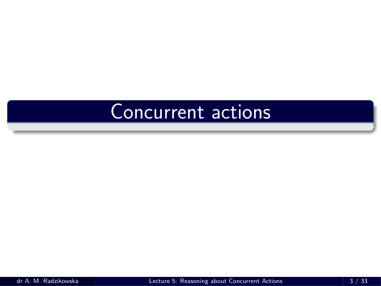
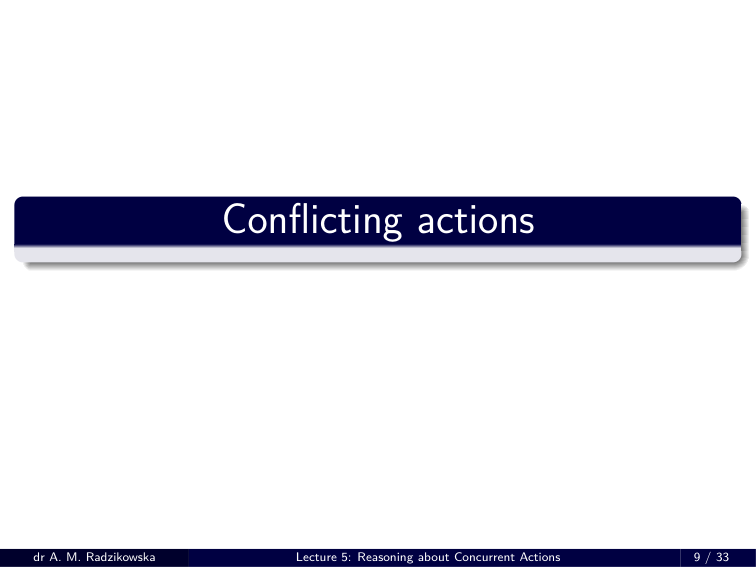
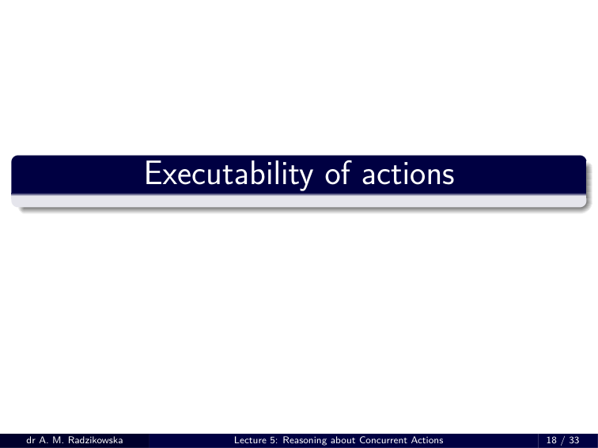

# RW 05 – HANDOUT

> Source: `RW_05___HANDOUT.pdf`

---

## Knowledge Representation

    - **Lecture 5: Reasoning about Concurrent Actions**
    - **dr Anna Maria Radzikowska**
    - Warsaw University of Technology
    - Faculty of Mathematics and Information Science
    - Building MiNI PW, room 504
    - E-mail: Anna.Radzikowska@pw.edu.pl
    - Warsaw 2026

---

## Outline

1. Problems: conflicts and actions’ executability
2. Effects of concurrent actions: inheritance and restricted inheritance
3. Action Language *AC* – Syntax
4. Conflicting actions
5. Exacutability of actions
6. Decomposition of actions
7. Resulting states
8. Semantics of *AC*
  - Structures
  - Models
  - Example: Producer & Consumers

---

## Concurrent actions

---

## Problems

### Conflict

- What does it mean ***conflicting actions*** ? In the theory of concurrency it is assumed that two processes accessing the same source are conflicting. In general case, however, this approach seems too restrictive. For example, two robots can pick up a heavy block simultaneously. Moreover, this action may be unexecutable by each robot separately.

### Executability of actions

- The conflict problem is a particular case of the one of actions’ executability – clearly, conflicting actions cannot be executed concurrently. However, actions cannot be executed due to other reasons. For example, if there is a distance between the window and the door, I am not able to open them simultaneously.

---

## Two examples: effects of concurrent actions

### Example 5.1

- Mary is lifting a bowl of soup from the kitchen table, while John is opening the door to the dinning room. These two actions are independent, so they can be performed simultaneously leading to the effect being the conjunction of effects of particular actions (i.e., the door is open and the bowl is lifted) – this way the *compound* action inherits results from its subactions.

### Example 5.2

- Whenever Mary tries to lift the bowl with one hand, she spills the soup (but lifted the bowl). But when she uses both hands, she does not spill the soup. We know that the soup is not spilled initially and the bowl is not lifted. Now the effect“ *the soup is spilled* ” is not inherited when two actions, LiftLeft and LiftRight , are executed simultaneously.

---

## Effects of concurrent actions

- Let *D* be an action domain and let the compound action *A* = *{ A* 1 *, . . . , A k }* , *k* ⩾ 2, be given.

### Inheritance

- If there is no statement in *D* describing effects of any subset of *A* , the concurrently executed actions lead to the effect being the conjunction of effects of particular actions.

### Restricted inheritance

- If there is an action description statement in *D* referring to some subset *A ′ ⊆ A* , then the inheritance rule is not applied for elements of *A ′* : *A ′* leads to the effect given in statements in *D* referring to *A ′* and no effect of the actions *A ′* is composed of is taken into account. In other words, if such a statement is mentioned in *D* , it constitutes a“new action” (wrt its results).

---

## Action Language *AC* – Syntax

### Syntax

  - ***Signature*** : a pair Υ = ( *F , A c* ) where *F* is the set of ***fluents*** and *A c* is the set of ***atomic actions*** (atoms).
  - A ***compound action*** is any set *A ⊆A c* of atoms.
  - A ***statement*** of *AC* is any statement of *AR* where instead of atomic actions we use compound actions, referred to as ***actions*** .
  - An ***action domain*** is a non-void set of statements.

---

## Action Language *AC*

### Elementary actions

- Let *D* be an action domain. an ***elementary action*** is any action *A ⊆⊣ c* such that *D* contains any of the following statements:
    - A ***causes*** *α* ***if*** *π* A ***releases*** *f* ***if*** *π* .
- The set of all elementary actions in *D* will be denoted by *Elem* ( *D* ) .

---

## Conflicting actions

---

## Conflicting actions

### Example 5.3

- Consider the following two statements:
    - A ***causes*** *f ∨ g* ; B ***causes*** *f*
- where A and B are atomic actions. Let *σ* = *{¬ f , ¬ g }* . Performing A in *σ* leads to two states:
    - *σ* 1 = *{ p , ¬ g } ,*
    - *σ* 2 = *{¬ f , g }*
- while performing B in *σ* leads to *σ* 1 .
- If we admit parallel execution of A and B in *σ* , then the resulting state will be *σ* 1 .

### Thus composing a nondeterministic action with a deterministic one we obtain a deterministic action!

---

## Conflicting actions (cont.)

### Example 5.4

- Consider the following statements:
    - A ***causes*** *f ∨ g* ; B ***releases*** *f* .
- Again, let *σ* = *{¬ f , ¬ g }* . Performing a leads to either of these states:
    - *σ* 1 = *{ f , ¬ g } ,*
    - *σ* 2 = *{¬ f , g } ,*
- while executing B in *σ* leads to either *σ* or *σ* 1 .
- Again, if we admit performing *{* A , B *}* , the resulting state will be *σ* 1 .

### Then the composition of two deterministic actions makes a deterministic action!

---

## Conflicts – problematic cases

### Case 1

- *D* contains the following statements:
    - A ***causes*** *α* ***if*** *π* B ***releases*** *f* ***if*** *ψ*
- where
  - *α ⇔ γ* 1 *∨ . . . ∨ γ k* ;
  - *γ i* = *λ* 1
    - *i ∧ . . . ∧ λ k i*
    - *i* , where *λ k j*
    - *i* is a literal;
  - there is some *i* = 1 *, . . . , k* and *j* = 1 *, . . . , k i* such that *f* = *λ j*
    - *i* .
- In other words, *f* occurs in at least one possible effect of performing A in a state satisfying *π ∧ ψ* .

---

## Conflicts – problematic cases

### Case 2

- *D* contains the following statements:
    - A ***causes*** *α* ***if*** *π* B ***causes*** *β* ***if*** *ψ*
- where
  - *α ⇔ γ* 1 *∨ . . . ∨ γ k* and *β ⇔ δ* 1 *∨ . . . ∨ δ m* ;
  - each *γ i* = *λ* 1
    - *i ∧ . . . ∧ λ k i*
    - *i* and *δ p* = *τ* 1
    - *p ∧ . . . ∧ τ k p*
    - *p* where *λ j*
    - *i* and *τ l*
    - *p* are
  - literals;
  - there is some *i* = 1 *, . . . , k* and *p* = 1 *, . . . , m* such that *γ i* and *δ p* contain complementary literals (i.e., *f* and *¬ f* ).
- In other words, there is a possible effect of A ( *γ i* ) **contradictory** to some possible effect of B ( *δ p* ), both actions performed a state satisfying *σ |* = *π ∧ ψ* .

---

## Disjunctive Normal Form

- Let *α* be any formula over *F* . We say that *α* **is in DNF** iff
    - *k* ( *i* ) ^
    - *n* _
    - *α* =
    - *j* =1 *λ ij ,*
    - *i* =1
- where *λ ij* is a literal, *i* = 1 *, . . . , n* , *j* = 1 *, . . . , k* ( *i* ).
- E.g., *α* 1 = ( *p ∧ q* ) *∨¬ r* is in DNF.

### Theorem 5.1

- Every formula *α* can be uniquely transformed to the formula *α ′* in DNF such that *α ⇔ α ′* .
- **Notation:** The formula resulting from transformation of *α* into DNF will be denoted **DNF(** *α* **)** .
- For *DNF* ( *α* ) = *γ* 1 *∨ . . . ∨ γ k* , each *γ i* is called a ***component of*** *α* .

---

## Converting to DNF

### Algorithm

1. Eliminate *→* and *⇔* :
    - *α → β*
    - ⇝
    - *¬ α ∨ β*
    - *α ⇔ β*
    - ⇝
    - ( *¬ α ∨ β* ) *∧* ( *¬ β ∨ α* ) *.*
2. Move *¬* to the right:
    - *¬* ( *α ∧ β* )
    - ⇝
    - *¬ α ∨¬ β*
    - *¬* ( *α ∨ β* )
    - ⇝
    - *¬ α ∧¬ β*
    - *¬¬ α*
    - ⇝
    - *α.*
3. Distribution *∨* over *∧* :
    - *α ∧* ( *β ∨ γ* )
    - ⇝
    - ( *α ∧ β* ) *∨* ( *α ∧ γ* )
    - ( *β ∨ γ* ) *∧ α*
    - ⇝
    - ( *β ∧ α* ) *∨* ( *γ ∧ α* ) *.*

---

## Conflicting actions

- Let *D* be an action domain, let *σ* be a state, and let *A , B ⊆A c* be two actions. We say that *A* and *B* are ***conflicting in*** *σ* iffat least one of the following holds:

### Case 1

- There are two statements in *D* of the form
    - A ***causes*** *α* ***if*** *π* ; B ***causes*** *β* ***if*** *ψ*
- such that
  - *σ |* = *π ∧ ψ* ;
  - some component of *α* is inconsistent with some component of *β* .

---

## Conflicting actions (cont.)

### Case 2

- There are two statements in *D* of the form:
    - A ***causes*** *α* ***if*** *π* ; B ***releases*** *f* ***if*** *ψ*
- such that
  - *σ |* = *π ∧ ψ* ;
  - *f* occurs in some component of *α* .

---

## Executability of actions

---

## Executability of actions

- Lack of conflict does not mean that actions are executable in a state.

### Example 5.5

- Consider the following action domain:
    - PaintDoor ***causes*** *pDoor* ; PaintWall ***causes*** *pWall* ; PaintWindow ***causes*** *pWindow* ; ***impossible*** *{* PaintDoor , PaintWindow *}* .
- Let *σ* = *{¬ pDoor , ¬ pWindow , ¬ pDoor }* . Is it possible to execute *A* = *{* PaintWall , PaintWindow , PaintDoor *}* in *σ* ?

---

## Executability of actions (cont.)

### Two possibilities

1. Neither A nor any of its supset is executable;
2. The action A becomes a non-deterministic: either *{* PaintDoor , PaintWall *}* or *{* PaintWindow , PaintWall *}* is actually performed.
- In the following we will adopt the second case!

---

## Executability of actions

### Potentially executable actions

- Let *D* be an action domain and let *σ* be a state. An action A = *{ A* 1 *, . . . , A k }* with *A i ∈ Elem* ( *D* ) is ***potentially executable in*** *σ* iff there is no an action B *⊆* S *k*
    - *i* =1 A *i* such that *D* contains statements
    - B ***causes*** *α* 1 ***if*** *π* 1 ; . . . B ***causes*** *α n* ***if*** *π n*
- such that
  - *σ |* = *π* 1 *∧ . . . ∧ π n* ;
  - *α* 1 *∧ . . . ∧ α n* is inconsistent.

---

## Potentially executable actions

### Example 5.6

- Consider the following action domain:
    - A ***causes*** *p* ***if*** *q* ; B ***causes*** *¬ q* ***if*** *q* ; C ***causes*** *s* ***if*** *q* ; *{* A,B *}* ***causes*** *¬ r* ***if*** *q* ; ***impossible*** *{* A,C *}* ***if*** *r* .
- Let *σ |* = *q ∧ r* . Note that elementary actions *}* A , B *}* and *{* C *}* are not potentially executable since *{* A,B *} ∪{* A,C *}* leads to *¬ r ∧⊥* .
- However, *{* B *}* and *{* C *}* are potentially executable.

---

## Decomposition of actions

### Decomposition of actions

- Let *D* be an action domain, let *σ* be a state, and let A *⊆A c* . A ***decomposition of*** A ***in*** *σ* is a set ∆( A *, σ* ) = *{* E 1 *, . . . ,* E *k }* of elementary actions in *D* such that
- **(D1)** S *k*
  - *i* =1 E *i ⊆* A ;
- **(D2)** ∆( A *, σ* ) is the set of non-conflicting actions potentially executable
  - in *σ* ;
- **(D3)** there is no set *{* E *′*
  1. *, . . . ,* E *k , . . . ,* E *m }* of elementary actions
  - satisfying the above two conditions and, in addition, E *i ⊂* E *′*
    - *i* for some
  - *i* = 1 *, . . . , k*
- Note that **(D3)** states the maximality of ∆( A *, σ* ).

### Components

- If ∆( A *, σ* ) = *{* E 1 *, . . .* E *k }* is a decomposition of A in *σ* , then each E *i* , *i* = 1 *, . . . , k* , is a ***component of the decomposition*** ∆ ***of*** A ***in*** *σ* .

---

## Example

### Example 5.7

- Consider the following action domain *D* :
    - A ***causes*** *¬ p* ***if*** *p* ; B ***causes*** *q* ***if*** *p* ; C ***causes*** *r* ***if*** *p* ; D ***causes*** *w* ***if*** *p* ; *{* A,B *}* ***causes*** *v* ***if*** *p* ; *{* B,C *}* ***causes*** *s* ***if*** *p* ; *{* A,B,C *}* ***causes*** *f* ***if*** *p* ; ***impossible*** *{* A,C *}* .
- Let E = *{* A,B,C,D *}* and let *σ |* = *p* . There are two decompositions of E in *σ* , namely
    - ∆ 1 ( E *, σ* ) = *{{* A,B *} , {* D *}}*
    - ∆ 2 ( E *, σ* ) = *{{* B,C *} , {* D *}} .*

---

## Resulting states

### Potentially resulting states

- Let *D* be an action domain, let *σ, σ ′* be two states, let A *⊆A c* , and let ∆( A *, σ* ) = *{* E 1 *, . . . ,* E *k }* be a decomposition of A in *σ* . We say that *σ ′* is a ***potentially resulting state of executing*** A ***in*** *σ* ifffor every *i* = 1 *, . . . , k* and for every statement
    - ( E *i* ***causes*** *α* ***if*** *π* ) *∈ D ,*
- *σ |* = *π* implies *σ ′ |* = *α* .
- Intuitively, while performing A in *σ* , we get a (potentially) resulting state satisfying all effects of its components E *i* in *σ* which belong to the same decomposition.

---

## Resulting states (cont.)

### Potentially resulting states

- In other words, if A has *n* distinct decomposition:
    - ∆ 1 ( A *, σ* ) = *{* E 1
  1. *, . . . ,* E 1
    - *k* 1 *}*
    - *. . .*
    - ∆ *n* ( A *, σ* ) = *{* E *n*
  1. *, . . . ,* E *n*
    - *k n }*
- and the execution of E *j*
    - *i* in *σ* has the effect *α j*
    - *i* , then the potentially
- resulting state *σ ′* (of performance of A in *σ* ) satisfies
    - ( *α* 1 1 *∧ . . . ∧ α* 1
    - *k* 1 ) *∨ . . . ∨* ( *α n*
  1. *∧ . . . ∧ α n*
    - *k n* ) *.*

---

## Resulting states (cont.)

### Example 5.7 (cont.)

    - A ***causes*** *¬ p* ***if*** *p* ; B ***causes*** *q* ***if*** *p* ; C ***causes*** *r* ***if*** *p* ; D ***causes*** *w* ***if*** *p* ; *{* A,B *}* ***causes*** *v* ***if*** *p* ; *{* B,C *}* ***causes*** *s* ***if*** *p* ; *{* A,B,C *}* ***causes*** *f* ***if*** *p* ; ***impossible*** *{* A,B *}* .
- Executing E = *{* A,B,C,D *}* in *σ* potentially leads to two states *σ ′* and *σ ′′*
- such that
    - *σ ′ |* = *v ∧ w*
    - *σ ′′ |* = *s ∧ w .*
- Hence, after E , we have for sure *w* and either *v* or *s* .

---

## Structures

### Structure

- Let *L* be a language of the class *AC* . A ***structure for*** *L* is a triple (Σ *, σ* 0 *, Res* ) where Σ is a set of states, *σ* 0 *∈* Σ is the initial state, and *Res* : 2 *A c ×* Σ *→* 2 Σ is a transition function.
- Function *Res* 0
- Let *D* be an action domain in *L* of the class *AC* . Define an auxiliary function *Res* 0 : 2 *A c ×* Σ *→* 2 Σ for every A *⊆A c* and for every *σ ∈* Σ,
  - if A in *σ* has *n* decompositions ∆ 1 ( A *, σ* ) *, . . . ,* ∆ *n* ( A *, σ* ) with ∆ *i* ( A *, σ* ) = *{* A *i*
  1. *, . . . ,* A *i*
    - *k i }* , then *Res* 0 ( A *, σ* ) is the set of all po-
  - tentially resulting states of performing A in *σ* .

### Function *New*

- for any A *⊆A c* , for any *σ ∈* Σ, and for any *σ ′ ∈ Res* 0 ( A *, σ* ), *New* ( A *, σ, σ ′* ) is defined as in the semantics of *AR* .

---

## Models

### Model

- Let *D* be an action domain in a language *L* of the class *AC* . A structure *S* = (Σ *, σ* 0 *, Res* ) is ***model*** of *D* iff
- **(M1)** Σ is the set of all states of *D* , i.e., the set of all states satisfying all
  - constraints in *D* ;
- **(M2)** each value statement and each observation statement in *D* is true
  - in *S* (defined analogously as in *AR* );
- **(M3)** for every A *⊆A c* and for every *σ ∈* Σ, *Res* ( A *, σ* ) *⊆ Res* 0 ( A *, σ* ) is
  - the set of all states *σ ′ ∈* Σ for which the sets *New* ( A *, σ, σ ′* ) are minimal wrt set inclusion.

---

## Example: Producer & Consumers

### Example 5.8

  - *There is a producer and two consumers, A and B. The producer* *puts to the buffer as many tems of his product as possible by per-* *forming an action* Put *. Each consumer can perform two actions* Consume *and* Get *. The action* Get *makes the buffer empty and* *the consumer has a product, while the action* Consume *causes* *that the consumer does not have an item.*
- Representation in *AC* :
    - Put ***causes*** *¬ empty* ; GetA ***causes*** *empty ∧ hasA* ***if*** *¬ empty* ; GetB ***causes*** *empty ∧ hasB* ***if*** *¬ empty* ; ConsumeA ***causes*** *¬ hasA* ***if*** *hasA* ; ConsumeB ***causes*** *¬ hasB* ***if*** *hasB* ; ***impossible*** *{* GetA, GetB *}* .

---

## Example: Producer & Consumers (cont.)

### Example 5.8 (cont.)

  - Consider *σ* = *{ hasA , hasB , ¬ empty }* and the action A = *{* Put, GetA, GetB, ConsumeA, ConsumeB *}* .
  - The actions Put and GetA , as well as the actions Put and GetB , are conflicting in *σ* , thus executing Put makes GetA and GetB unexecutable.
  - Similarly, GetA and GetB are together unexecutable and either of these action can be performed at a time.
  - Moreover, GetA and ConsumeA , as well as GetB and ConsumeB , are conflicting.

---

## Example: Producer & Consumers (cont.)

### Example 5.8 (cont.)

- Hence, we obtain the following three decompositions of A in *σ* :
    - ∆ 1 ( A *, σ* ) = *{* Put, ConsumeA, ConsumeB *}*
    - ∆ 2 ( A *, σ* ) = *{* GetA, ConsumeB *}*
    - ∆ 3 ( A *, σ* ) = *{* GetB, ConsumeA *}*
- Therefore, *Res* ( A *, σ* ) = *{ σ* 1 *, σ* 2 *, σ* 3 *}* where
    - *σ* 1 = *{¬ hasA , ¬ hasB , ¬ empty }*
    - *σ* 2 = *{ hasA , ¬ hasB , empty }*
    - *σ* 2 = *{¬ hasA , hasB , empty } .*

---

## Thank you for your attention!

---

