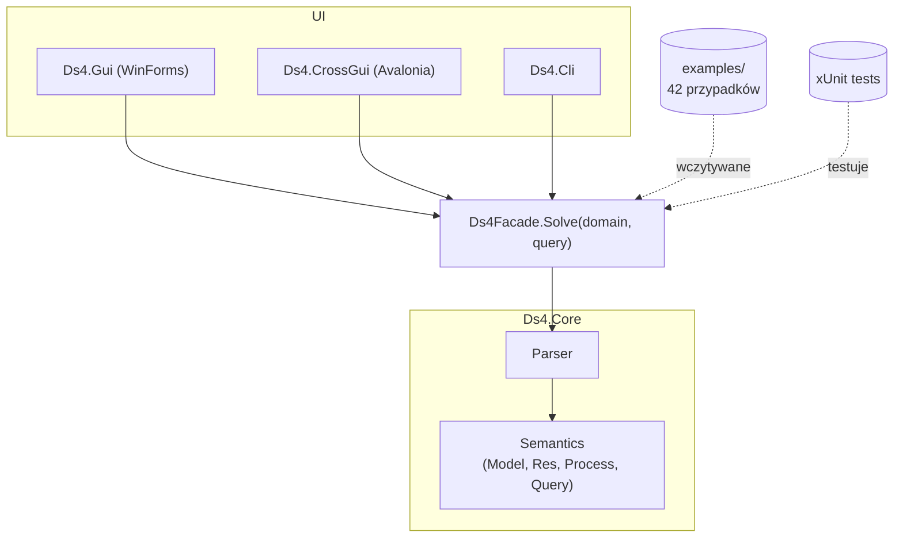
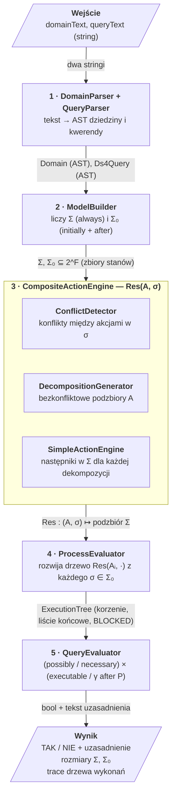

# Projekt 4 — Procesy działań złożonych

Mały reasoner dla klasy systemów dynamicznych **DS4**. Czyta opis dziedziny i kwerendę,
buduje model w pamięci, odpowiada **TAK / NIE** + trace.

Implementacja: `checkpoint3/csharp` (C# / .NET 8). Frontendy: WinForms, Avalonia, CLI.

---

## Interfejs

Okno ma cztery elementy:

- **Lista przykładów + „Wczytaj przykład"** — 42 wbudowane przypadki z folderu `examples/` (TAK / NIE × `tex` / `extra` / `bugfix`).
- **Dziedzina** (lewy panel) — edytowalny tekst dziedziny w języku akcji: `causes`, `releases`, `impossible`, `always`, `initially`, `after`. Komentarze `# …`.
- **Kwerenda** (prawy górny panel) — jedno zdanie `possibly | necessary` × `executable | γ after P`.
- **Wynik** (prawy dolny panel) — `ODPOWIEDŹ: TAK / NIE`, rozmiary `|Σ|` i `|Σ₀|`, krótkie uzasadnienie i pełny **trace** drzewa wykonań (każdy węzeł: krok procesu → stan końcowy).

---

## Architektura

- **UI** (WinForms / Avalonia / CLI) — tylko pola tekstowe, lista przykładów, przycisk „Oblicz". Trzy frontendy, ta sama logika.
- `**Ds4Facade`** — jedyne API, którego używa UI. Bierze dwa stringi (dziedzina, kwerenda), zwraca `SolveResult { Answer, Explanation, |Σ|, |Σ₀|, Trace }`.
- `**Ds4.Core`** — czysty silnik bez zależności od UI: `Parser` zamienia tekst na AST, `Semantics` buduje model i odpowiada na kwerendę.
- `**examples/**` — 42 pary `.domain` + `.query` ładowane przez fasadę do listy w GUI/CLI.
- `**tests/**` — xUnit; testują fasadę i moduły semantyki bezpośrednio, w tym wszystkie 42 przykłady przeciw plikom `.expected`.

Core nie wie nic o UI — wymiana frontendu nie zmienia ani jednej linii w silniku.

---

## Przepływ podczas rozwiązywania

Co dzieje się na każdym kroku:

1. **Parsowanie.** Tekst dziedziny i kwerendy zamieniamy na strukturę: lista fluentów, akcji, reguł `causes` / `releases` / `impossible`, ograniczeń `always` / `initially` oraz definicja procesu i celu. *(`DomainParser`, `QueryParser`)*
2. **Przestrzeń stanów.** Generujemy wszystkie `2^|F|` wartościowania fluentów, odsiewamy te niezgodne z `always` → zostaje `Σ`. Z `Σ` wybieramy stany zgodne z `initially` i z asercjami `after` → zostaje `Σ₀` (zbiór możliwych stanów początkowych przy częściowym opisie). *(`StateGenerator`, `ModelBuilder`)*
3. **Operacja `Res` — jeden krok procesu.** Definicja w dwóch poziomach; krok złożony korzysta z prostego:
  - **Akcja prosta `a` w stanie `σ`.** Jeśli `impossible a` jest aktywne → brak następników. W przeciwnym razie bierzemy aktywne efekty `causes` / `releases` i jako następniki wybieramy te stany z `Σ`, które te efekty spełniają **i** najmniej zmieniają fluenty inercyjne. Tak realizujemy inercję (Z1) i ramification (Z6). *(`SimpleActionEngine`)*
  - **Akcja złożona `A = {a₁,…,aₖ}` w `σ`.** Dwie akcje są w konflikcie, jeśli w `σ` wpływają na te same fluenty. Budujemy graf konfliktu, wyciągamy **maksymalne bezkonfliktowe podzbiory** `A`, dla każdego liczymy jego wspólny `Res` (przez krok prosty) i bierzemy sumę. *(`ConflictDetector`, `DecompositionGenerator`, `CompositeActionEngine`)*
4. **Wykonanie procesu.** Z każdego `σ ∈ Σ₀` rozwijamy drzewo: korzeń → dzieci = `Res(A₁, σ)` → wnuki = `Res(A₂, ·)` itd. Gałąź, na której gdzieś `Res = ∅`, dostaje status **BLOCKED**; gałąź długości `n` kończy się **liściem końcowym**. *(`ProcessEvaluator`)*
5. **Decyzja kwerendy.** Patrzymy na drzewo:
  - `possibly executable` — istnieje liść końcowy,
  - `possibly γ` — istnieje liść końcowy spełniający `γ`,
  - `necessary executable` — `Σ₀ ≠ ∅`, brak blokad i są liście końcowe,
  - `necessary γ` — jak wyżej **i** wszystkie liście końcowe spełniają `γ`. *(`QueryEvaluator`)*

---

## Kwestie do ogarnięcia

- **Syntax sugar.** Doprecyzować zbiór skrótów składniowych, których parser ma oficjalnie wspierać: `impossible A` jako skrót `A causes ⊥ if …`, `initially α` jako skrót `α after ε`, opcjonalne deklaracje `fluents` / `actions`, średniki kończące zdania, komentarze `#` / `//`. Spisać to jednolicie w gramatyce i w dokumentacji użytkownika.
- **Kwerendy `possibly`.** Domknąć semantykę `possibly executable` i `possibly γ after P` w stylu zgodnym z [SUM‑4]: „istnieje model, stan początkowy z `Σ₀` i pełna ścieżka". Sprawdzić, czy nasza implementacja zachowuje się dokładnie tak, gdy `Σ₀ = ∅` i gdy proces jest pusty (`P = ε`); dorzucić brakujące przykłady `possibly` do folderu `examples/`.

